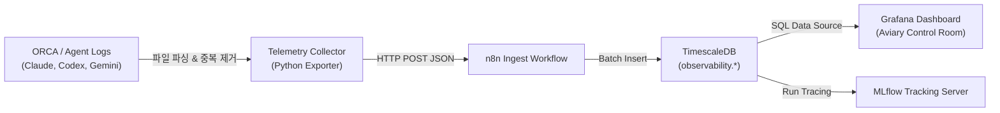

# LLM 토큰 사용량 및 에이전트 관측성(Observability) 파이프라인 설계

## 1. 개요

Codex, Claude, Gemini 등 다중 AI 제공자를 활용한 코딩 에이전트(ORCA, Hermes, Antigravity) 운영 시 발생하는 **토큰 사용량·비용·성공률·캐시 효율**을 표준화하여 수집·시각화하는 엔지니어링 패턴을 정의한다.

## 2. 관측성 데이터 모델: 토큰 정규화 스키마

제공자마다 토큰 분류와 응답 구조가 다르므로 공통 수집 레이어에서 정규화해야 한다.

| 지표명 | Claude (Anthropic) 대응 | Codex / OpenAI 대응 | Gemini 대응 | 의미 및 비용 영향 |
|---|---|---|---|---|
| `uncached_prompt_tokens` | `input_tokens` | `prompt_tokens - cached_tokens` | `prompt_token_count` | 신규 처리된 비캐시 입력 (기본 입력 단가) |
| `cache_read_tokens` | `cache_read_input_tokens` | `prompt_tokens_details.cached_tokens` | `cached_content_token_count` | 프롬프트 캐시 적중 토큰 (할인 단가, 보통 10~20%) |
| `cache_write_tokens` | `cache_creation_input_tokens` | (미제공 또는 0) | (자동 캐시) | 캐시 생성 토큰 (할증 단가, 보통 125%) |
| `output_tokens` | `output_tokens` | `completion_tokens` | `candidates_token_count` | 생성된 응답 토큰 (최고 단가) |

### 2.1 캐시 효율 계산 공식
$$\text{Cache Hit Ratio (\%)} = \frac{\text{cache\_read\_tokens}}{\text{uncached\_prompt\_tokens} + \text{cache\_read\_tokens}} \times 100$$
* 주의: 단순 총 토큰 수가 크다고 낭비가 아니며, 캐시 적중률이 높아도 불필요한 반복 호출이 없었는지 세션 단위 검토가 병행되어야 한다.

## 3. 엔드투엔드 파이프라인 아키텍처



### 3.1 세션 및 쓰레드 메타데이터 태깅
단순 날짜별 합산이 아닌 **원인 추적성(Traceability)**을 위해 이벤트마다 아래 메타데이터를 필수 부착한다:
* `project_key`: 대상 프로젝트 (예: `RobinGraph`, `Birds-Nest`)
* `session_id_hash`: 개인정보를 노출하지 않는 익명화 세션 키
* `model`: 실제 실행 모델 식별자 (예: `claude-3-5-sonnet`, `gemini-2.5-pro`)
* `task_status`: `success` | `failed` | `aborted` | `unknown`
* `tool_errors_count`: 도구 호출 실패 및 재시도 횟수

## 4. 데이터베이스 스키마 설계 권장안 (TimescaleDB)

```sql
-- 1. 개별 호출/세션 이벤트 테이블 (하이퍼테이블)
CREATE TABLE IF NOT EXISTS observability.agent_token_events (
    time TIMESTAMPTZ NOT NULL,
    provider TEXT NOT NULL,
    model TEXT NOT NULL,
    project_key TEXT NOT NULL,
    session_hash TEXT NOT NULL,
    uncached_prompt_tokens INT DEFAULT 0,
    cache_read_tokens INT DEFAULT 0,
    cache_write_tokens INT DEFAULT 0,
    output_tokens INT DEFAULT 0,
    tool_error_count INT DEFAULT 0,
    task_outcome TEXT DEFAULT 'unknown'
);

SELECT create_hypertable('observability.agent_token_events', 'time', if_not_exists => TRUE);

-- 2. 일별/프로젝트별 롤업 뷰
CREATE MATERIALIZED VIEW IF NOT EXISTS observability.daily_project_usage
WITH (timescaledb.continuous) AS
SELECT 
    time_bucket('1 day', time) AS bucket,
    project_key,
    provider,
    sum(uncached_prompt_tokens + cache_read_tokens + cache_write_tokens + output_tokens) AS total_tokens,
    sum(uncached_prompt_tokens) AS non_cached_input,
    sum(cache_read_tokens) AS cache_hits,
    sum(output_tokens) AS total_output,
    count(DISTINCT session_hash) AS session_count
FROM observability.agent_token_events
GROUP BY bucket, project_key, provider;
```

## 5. Grafana 핵심 패널 쿼리 패턴

### 5.1 프로젝트별 7일간 토큰 소모 추이 (Stacked Area)
```sql
SELECT
  time_bucket('1 day', time) AS "time",
  project_key,
  sum(uncached_prompt_tokens + cache_read_tokens + cache_write_tokens + output_tokens) AS "총 토큰"
FROM observability.agent_token_events
WHERE time > NOW() - INTERVAL '7 days'
GROUP BY 1, 2
ORDER BY 1, 2;
```

### 5.2 캐시 적중률 및 도구 실패율 게이지
```sql
SELECT
  round(sum(cache_read_tokens)::numeric / NULLIF(sum(uncached_prompt_tokens + cache_read_tokens), 0)::numeric * 100, 1) AS "캐시 적중률 (%)",
  sum(tool_error_count) AS "총 도구 실패 횟수"
FROM observability.agent_token_events
WHERE time > NOW() - INTERVAL '24 hours';
```

## 6. 관련 문서

* [[Work/Gullinkambi/2026-10-09-ORCA-Grafana-MLflow-Claude-작업명세|ORCA 개발 사용량·성과 Grafana/MLflow 작업 명세]]
* [[Work/Gullinkambi/작업기록/2026-10-01-AI-구독-사용량-수집기와-Grafana-대시보드-구축|AI 구독 사용량 수집기와 Grafana 대시보드 구축]]
* [[Dev/index|Dev 인덱스]]
