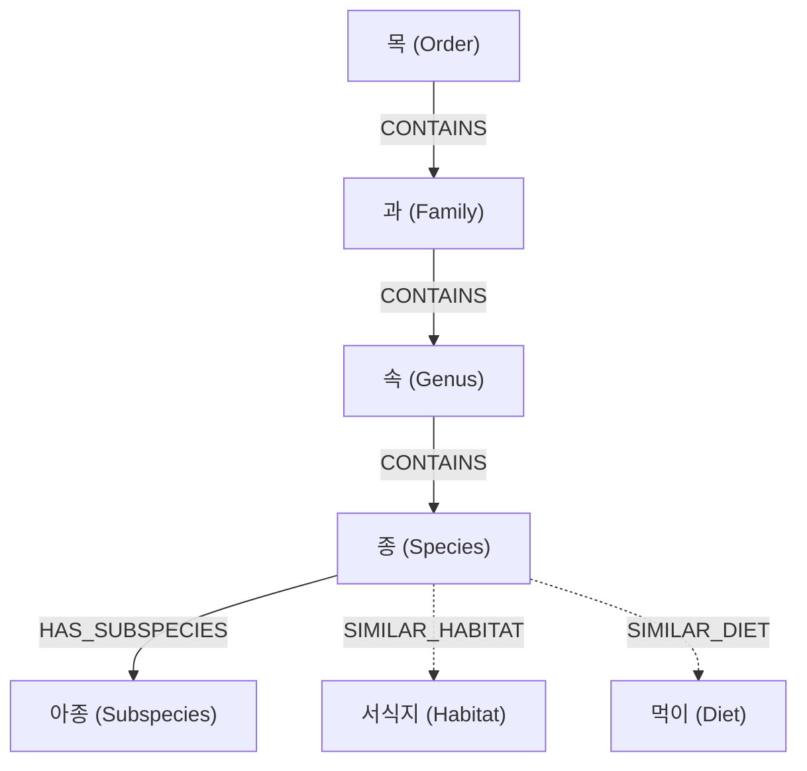

# Neo4j 지식 그래프 계통 모델링 및 근연관계 가중합 검색 패턴

## 1. 개요

RobinGraph 프로젝트에서 구축된 9,500여 종의 조류 지식 그래프를 바탕으로, **계층적 분류(Taxonomy) 구조 모델링**과 **노드 간 근연 관계(Phylogenetic Proximity)를 수치화하여 랭킹을 매기는 Cypher 가중합 검색 패턴**을 정리한다.

## 2. 그래프 데이터 모델: 계통 분류 스키마

생물 분류학(또는 계층적 카테고리)을 그래프로 표현할 때, 상위 분류군(Taxon) 노드와 개별 종(Species) 노드를 분리하여 방향성 관계(`IN_FAMILY`, `IN_GENUS` 등)로 연결한다.



### 2.1 노드 및 관계 설계 원칙
* **방향성 통일**: `(Species)-[:BELONGS_TO]->(Genus)-[:BELONGS_TO]->(Family)` 또는 역방향 중 하나로 일관되게 단방향 인덱싱.
* **표시명 다국어화**: 노드 프로퍼티에 `name_ko`(국명 후보), `name_en`(공식 영어명), `sci_name`(학명)을 분리 저장.
* **결측치 안전망**: 국명이 미확정된 종/아종은 학명 또는 영명을 fallback 표시명으로 지정.

## 3. 계통 거리 기반 근연종(Related Species) 탐색 Cypher 패턴

특정 기준 종(`$target_id`)과 가장 가까운 종을 계통수 상의 공통 조상 깊이(LCA, Lowest Common Ancestor)를 기준으로 탐색하는 기본 쿼리:

```cypher
MATCH (target:Species {id: $target_id})
MATCH (target)-[:BELONGS_TO*1..3]->(ancestor)<-[:BELONGS_TO*1..3]-(candidate:Species)
WHERE candidate <> target
WITH candidate, 
     CASE 
       WHEN (target)-[:BELONGS_TO]->(:Genus)<-[:BELONGS_TO]-(candidate) THEN 1.0  -- 같은 속 (가장 가까움)
       WHEN (target)-[:BELONGS_TO*2]->(:Family)<-[:BELONGS_TO*2]-(candidate) THEN 0.6 -- 같은 과
       WHEN (target)-[:BELONGS_TO*3]->(:Order)<-[:BELONGS_TO*3]-(candidate) THEN 0.3  -- 같은 목
       ELSE 0.1
     END AS taxonomy_score
RETURN candidate.id AS id, 
       candidate.name_ko AS name_ko, 
       candidate.sci_name AS sci_name, 
       taxonomy_score
ORDER BY taxonomy_score DESC
LIMIT 10;
```

## 4. 다속성 가중합 랭킹 알고리즘 (Weighted Scoring)

단순 계통 거리뿐 아니라 생태적 유사도(서식지, 먹이, 관찰 빈도)를 복합 평가할 때의 가중치 분배 모델:

### 4.1 가중치 산정 기준 (RobinGraph 표준)
$$\text{Total Score} = 0.50 \times S_{\text{계통}} + 0.30 \times S_{\text{분류군}} + 0.10 \times S_{\text{서식지}} + 0.10 \times S_{\text{먹이}}$$

| 평가 요소 | 가중치 | 평가 방식 |
|---|---|---|
| **계통 관계 (Taxonomy)** | **50%** | 속 일치(1.0) > 과 일치(0.6) > 목 일치(0.3) |
| **분류학적 일치 (Rank/Clade)** | **30%** | 아목/상과 등 세부 clade 일치 여부 |
| **서식지 유사도 (Habitat)** | **10%** | 자카드 유사도 (공유 서식지 노드 수 / 전체) |
| **먹이군 유사도 (Diet)** | **10%** | 자카드 유사도 (공유 먹이 노드 수 / 전체) |

### 4.2 복합 가중합 집계 Cypher 예시
```cypher
MATCH (target:Species {id: $target_id})
MATCH (candidate:Species)
WHERE candidate <> target

// 1. 계통 유사도 계산
OPTIONAL MATCH (target)-[:BELONGS_TO]->(g:Genus)<-[:BELONGS_TO]-(candidate)
OPTIONAL MATCH (target)-[:BELONGS_TO*2]->(f:Family)<-[:BELONGS_TO*2]-(candidate)

// 2. 공유 생태 속성 계산
OPTIONAL MATCH (target)-[:LIVES_IN]->(h:Habitat)<-[:LIVES_IN]-(candidate)
WITH candidate, g, f, count(DISTINCT h) AS shared_habitats

WITH candidate,
     (CASE WHEN g IS NOT NULL THEN 1.0 WHEN f IS NOT NULL THEN 0.6 ELSE 0.2 END) AS taxo_score,
     (CASE WHEN shared_habitats > 0 THEN 1.0 ELSE 0.0 END) AS habitat_score

WITH candidate,
     (0.7 * taxo_score + 0.3 * habitat_score) AS final_score
ORDER BY final_score DESC
LIMIT 3
RETURN candidate.name_ko, candidate.sci_name, final_score;
```

## 5. 실무 고려사항 및 최적화 팁

1. **국명 후보 우선 정책**: 한국어 사용자 인터페이스에서는 한국조류학회 공식 국명 후보를 우선 표시하고, 미확정 종은 학명/영명을 병기.
2. **카디널리티 폭발 방지**: `[:BELONGS_TO*1..3]` 경로 탐색 시 반드시 대상 노드(`$target_id`)에 인덱스가 걸려 있어야 하며, `LIMIT`를 조기 적용하여 불필요한 전체 순회를 방지할 것.
3. **캐싱 전략**: 상위 TOP 3 근연종 결과는 변경 주기가 매우 길므로 애플리케이션 계층(Redis 또는 Fast-API 인메모리)에 캐싱하여 Neo4j 부하를 최소화.

## 6. 관련 문서

* [[Work/RobinGraph/작업기록/2xx 검색·RAG·그래프 질의/2026-10-06-전체종-근연관계우선-계통근거-NAS배포|RobinGraph 전체 종 근연 우선 비교 및 NAS 배포 기록]]
* [[Work/RobinGraph/작업기록/2xx 검색·RAG·그래프 질의/2026-10-06-근연관계-가중합점수-NAS배포|RobinGraph 근연 관계 가중합 점수 배포 기록]]
* [[Dev/index|Dev 인덱스]]
