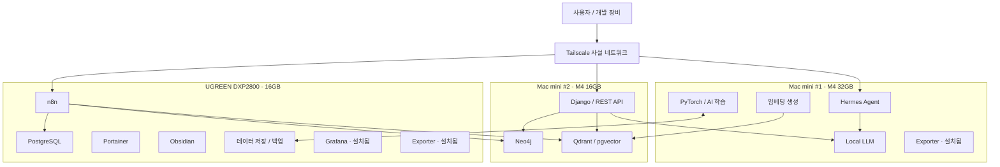
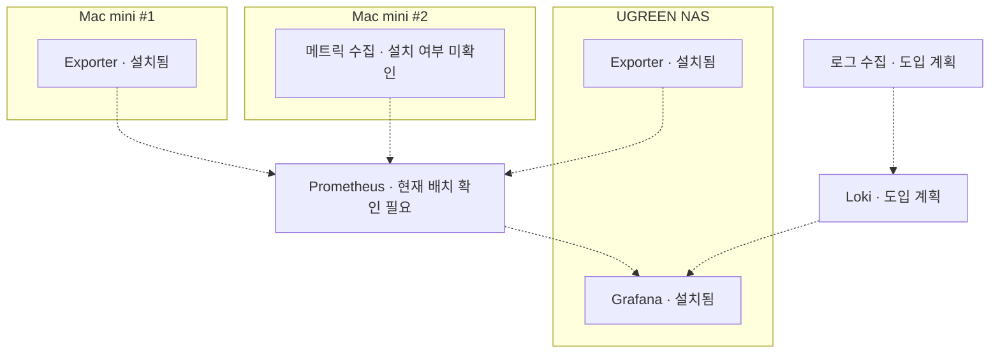

# 홈 AI 인프라 구성

## 1. 개요

### 1.1 구축 목적

Mac mini 2대와 UGREEN NAS 1대를 활용하여 개인 AI 개발 및 서비스 운영 환경을 구축한다.

**핵심 목표**

- 로컬 LLM 및 Hermes AI 에이전트 운영
- AI 모델 학습 및 추론
- Django 기반 웹 서비스 개발 및 배포
- n8n 기반 데이터 수집 자동화
- PostgreSQL, Neo4j 및 벡터 DB 운영
- 데이터셋 및 서비스 데이터 중앙 관리
- Tailscale 기반 사설 네트워크 구축
- 통합 모니터링 및 로그 관리
- 분산 작업 처리 환경 구축

### 1.2 운영 원칙

1. AI 연산, 애플리케이션, 데이터 수집 및 저장 역할을 분리한다.
2. 서비스별 메모리 사용량을 관리한다.
3. 외장 SSD는 데이터 및 모델 저장소로 활용한다.
4. macOS 스왑 메모리는 운영체제가 자동 관리하도록 유지한다.
5. 신규 장비를 구매하기 전에 기존 장비의 병목을 확인한다.
6. 외부 관리 접속은 가능한 Tailscale 사설 네트워크를 이용한다.

---

## 2. 현재 보유 장비

### 2.1 장비 목록

| 구분 | Mac mini #1 | Mac mini #2 | NAS #1 |
|---|---|---|---|
| 모델 | Apple M4 | Apple M4 | UGREEN DXP2800 |
| CPU | Apple M4 | Apple M4 | Intel N100 |
| RAM | 32GB | 16GB | 16GB |
| 내장 스토리지 | 256GB | 256GB | NAS 전용 스토리지 |
| 외장 SSD | 장착 완료 | 확장 예정 | SSD 장착 완료 |
| 운영체제 | macOS | macOS | UGOS Pro |
| 주요 역할 | AI 연산 서버 | 애플리케이션 서버 | 데이터 수집 및 저장 서버 |

**전체 물리 RAM: 64GB**

> 장비별 메모리는 독립적으로 사용되며, 64GB를 하나의 공유 RAM처럼 사용할 수는 없다.

### 2.2 Mac mini #1 — AI 연산 서버

**하드웨어**

| 항목 | 사양 |
|---|---|
| 모델 | Mac mini M4 |
| RAM | 32GB Unified Memory |
| 내장 SSD | 256GB |
| 외장 SSD | 장착 완료 |
| 운영체제 | macOS |

**권장 서비스**

- Hermes Agent
- 로컬 LLM
- PyTorch
- AI 모델 학습
- 임베딩 생성
- 데이터 전처리
- Exporter — 설치됨(종류 확인 필요)

**스토리지 역할**

내장 SSD:

- macOS
- 시스템 애플리케이션
- 스왑 메모리
- 시스템 캐시

외장 SSD:

- AI 모델 가중치
- 학습 데이터셋
- 모델 체크포인트
- AI 실험 결과
- 대용량 임시 파일

**운영 방침**

AI 학습과 LLM 추론은 메모리를 많이 사용하므로 동시에 실행하는 작업 수를 관리한다.

### 2.3 Mac mini #2 — 애플리케이션 서버

**하드웨어**

| 항목 | 사양 |
|---|---|
| 모델 | Mac mini M4 |
| RAM | 16GB Unified Memory |
| 내장 SSD | 256GB |
| 외장 SSD | 확장 예정 |
| 운영체제 | macOS |

**권장 서비스**

- Django
- Django REST Framework
- API 서버
- Docker
- Neo4j
- Qdrant 또는 pgvector

**스토리지 역할**

내장 SSD:

- macOS
- 시스템 애플리케이션
- 스왑 메모리

외장 SSD(확장 예정):

- Docker 영구 데이터
- 데이터베이스 파일
- Django 프로젝트
- 웹 서비스 데이터
- 애플리케이션 로그

**운영 방침**

16GB RAM 환경에서 Neo4j와 벡터 DB를 동시에 운영할 경우 메모리 사용량을 제한한다.

Milvus는 자원 요구량을 확인한 후 별도 배치 여부를 결정한다.

### 2.4 NAS #1 — 데이터 수집 및 저장 서버

**하드웨어**

| 항목 | 사양 |
|---|---|
| 모델 | UGREEN NASync DXP2800 |
| CPU | Intel N100 |
| RAM | 16GB |
| SSD | 장착 완료 |
| HDD | 현재 구성 확인 필요 |
| 운영체제 | UGOS Pro |

**권장 서비스**

- n8n
- PostgreSQL
- Grafana — 설치됨
- Exporter — 설치됨(종류 확인 필요)
- Portainer
- Obsidian
- Tailscale Gateway
- 데이터 백업
- 미디어 저장

**SSD 활용**

- Docker 데이터
- PostgreSQL 데이터
- n8n 데이터
- 애플리케이션 파일

**HDD 활용**

- 학습 데이터셋 백업
- AI 모델 백업
- 미디어 데이터
- 서비스 백업
- 장기 보관 데이터

---

## 3. 전체 인프라 아키텍처



> 이 구성도는 권장 아키텍처이며, 모든 서비스의 설치 완료 상태를 의미하지 않는다.

---

## 4. 서비스 배치 계획

| 서비스 | 권장 장비 | 역할 | 상태 |
|---|---|---|---|
| Hermes | Mac mini #1 | AI 에이전트 | 사용 중 |
| Local LLM | Mac mini #1 | 모델 추론 | 운영 계획 |
| PyTorch | Mac mini #1 | AI 학습 | 운영 계획 |
| Django | Mac mini #2 | 웹 서비스 | 배포 계획 |
| Neo4j | Mac mini #2 | 지식 그래프 | 배치 검토 |
| Qdrant / pgvector | Mac mini #2 | 벡터 검색 | 도입 검토 |
| Milvus | 미정 | 벡터 검색 | 추가 검토 |
| n8n | NAS | 데이터 수집 | 운영 구성 |
| PostgreSQL | NAS | 관계형 DB | 운영 구성 |
| Portainer | NAS | Docker 관리 | 사용 중 |
| Obsidian | NAS | 지식 관리 | 사용 중 |
| Tailscale | 전체 장비 | 사설 네트워크 | 운영 구성 |
| Grafana | NAS | 모니터링 | 설치됨 / 통합 범위 확인 필요 |
| Exporter (NAS) | NAS | 메트릭 노출 | 설치됨 / 종류 확인 필요 |
| Exporter (Mac mini #1) | Mac mini #1 | 메트릭 노출 | 설치됨 / 종류 확인 필요 |
| Loki | 미정 | 로그 수집 | 도입 계획 |

---

## 5. 메모리 관리

### 5.1 전체 RAM 구성

| 장비 | 물리 RAM |
|---|---:|
| Mac mini #1 | 32GB |
| Mac mini #2 | 16GB |
| UGREEN DXP2800 | 16GB |
| **합계** | **64GB** |

### 5.2 서비스별 예상 메모리 예산

| 서비스 | 초기 메모리 계획 |
|---|---:|
| n8n | 0.5~2GB |
| PostgreSQL | 0.5~2GB |
| Neo4j | 2~4GB부터 |
| Qdrant | 1~3GB부터 |
| Django | 0.5~2GB |
| Portainer | 0.1~0.3GB |
| 로컬 LLM | 모델 크기에 따라 상이 |
| AI 학습 | 모델 및 배치 크기에 따라 상이 |

> 위 값은 실제 측정 결과가 아닌 초기 계획용 수치다. 데이터와 동시 요청 수에 따라 사용량이 달라질 수 있다.

### 5.3 macOS 스왑 관리

Mac mini 두 대는 내장 SSD를 이용하여 스왑을 자동으로 관리한다.

확인 명령어:

```bash
sysctl vm.swapusage
```

메모리 압박 확인:

```bash
memory_pressure
```

스토리지 여유 공간 확인:

```bash
df -h /
```

**운영 기준**

- 내장 SSD 여유 공간 40~60GB 이상 유지 권장
- 지속적인 스왑 사용량 증가 시 서비스 분산
- 외장 SSD를 macOS 스왑 공간으로 강제 지정하지 않음
- 실제 RAM 사용량과 Memory Pressure 중심으로 모니터링

---

## 6. 스토리지 운영 전략

### 6.1 Mac mini #1

**AI 데이터 중심**

- 로컬 LLM 모델
- AI 학습 데이터셋
- 모델 체크포인트
- 실험 결과

대용량 데이터는 외장 SSD에 저장하고 중요 결과물은 NAS로 백업한다.

### 6.2 Mac mini #2

**애플리케이션 데이터 중심**

- Django 프로젝트
- Docker 볼륨
- Neo4j 데이터
- 벡터 DB 데이터
- 애플리케이션 로그

외장 SSD 확장 후 데이터 저장 위치를 분리한다.

### 6.3 NAS

**중앙 저장 및 백업 중심**

- n8n 실행 데이터
- PostgreSQL 데이터
- 서비스 백업
- 모델 및 데이터셋 백업
- Obsidian 데이터
- 미디어 파일

중요 데이터는 RAID 구성과 별도로 독립적인 백업을 유지한다.

---

## 7. 네트워크 구성

### 7.1 Tailscale

**사용 목적**

- 서버 간 안전한 통신
- SSH 원격 접속
- MagicDNS
- 내부 웹 서비스 접근
- 데이터베이스 접근
- 외부 환경에서 개발 및 관리

### 7.2 Cloudflare DNS

서비스별 도메인을 관리한다.

예시:

```text
gateway.dove-nest.com
```

Tailscale 내부 전용 서비스는 외부 공개 없이 접근하도록 구성한다.

Cloudflare DNS와 Tailscale ACL 및 HTTPS 설정은 각각 별도로 관리한다.

---

## 8. 컨테이너 및 서비스 관리

### 8.1 Docker

주요 운영 대상:

- Django
- Neo4j
- Qdrant
- n8n
- PostgreSQL
- Portainer

### 8.2 Portainer

현재 사용 중인 Docker 관리 도구.

주요 기능:

- 컨테이너 관리
- 이미지 관리
- Docker Compose 스택 관리
- 컨테이너 로그 확인
- 서비스 재시작 및 업데이트

### 8.3 컨테이너 운영 전략

- 서비스별 Docker Compose 파일 분리
- 데이터 볼륨과 컨테이너 분리
- 서비스별 메모리 제한 설정
- 환경변수 및 Secret 관리
- 데이터베이스 백업 자동화
- 주요 서비스 Health Check 구성

---

## 9. 분산 처리 계획

### 9.1 Celery

Python 기반 비동기 작업 큐.

**활용 예정**

- Django 백그라운드 작업
- 데이터 전처리
- 임베딩 생성
- 주기적 배치 작업
- 크롤링 후처리

Redis 또는 RabbitMQ 등을 메시지 브로커로 활용할 수 있다.

### 9.2 Ray

Python 기반 분산 연산 프레임워크.

**활용 예정**

- 병렬 데이터 처리
- 모델 추론 작업 분산
- 병렬 AI 실험
- 분산 학습 환경 검토

Mac mini 여러 대를 연결하더라도 통합 메모리와 GPU가 하나의 장비처럼 합쳐지는 것은 아니다.

### 9.3 도입 기준

- 일반 비동기 작업: Celery 우선 검토
- 분산 AI 연산: Ray 검토
- 운영 복잡도를 고려하여 단계적으로 도입

---

## 10. 통합 모니터링 구성

### 10.1 Grafana

**현재 상태:** NAS에 설치됨(2026-10-10 사용자 확인). 대시보드와 통합 모니터링의 실제 적용 범위는 별도 확인한다.

**모니터링 대상**

- CPU 사용률
- RAM 사용률
- Swap 사용량
- 디스크 사용량
- 네트워크 트래픽
- 서비스 상태
- 데이터베이스 성능

### 10.2 Prometheus

주요 메트릭 수집 및 저장. 현재 설치 상태, 배치 및 exporter 수집 대상은 확인이 필요하다.

### 10.3 Loki

중앙 로그 수집.

**수집 대상**

- Django
- Docker
- n8n
- Neo4j
- PostgreSQL
- Hermes

### 10.4 Exporter 설치 현황

| 장비 | 상태 | 추가 확인 사항 |
|---|---|---|
| NAS | 설치됨 | exporter 종류, 수집 지표, endpoint |
| Mac mini #1 | 설치됨 | exporter 종류, 수집 지표, endpoint |
| Mac mini #2 | 설치 여부 미확인 | 설치 필요 여부 |

설치 상태는 2026-10-10 사용자 설명을 반영했다. Exporter 설치만으로 모든 호스트 지표의 수집이나 Grafana 연동 완료를 의미하지는 않는다.

기존 [[Work/Gullinkambi/작업기록/2026-10-03-AI-subscription-exporter-README|AI subscription exporter 문서]]에는 Mac mini의 AI 구독 사용량 exporter가 기록되어 있다. 이번에 언급한 exporter와 동일한지, 호스트 지표 exporter가 별도로 있는지는 확인이 필요하다.

### 10.5 모니터링 아키텍처

실선은 확인된 장비별 설치 배치를 나타내고, 점선은 확인 또는 도입이 필요한 수집·연동 경로를 나타낸다.



---

## 11. 현재 장비 구축 체크리스트

### 하드웨어

- [x] Mac mini M4 32GB 확보
- [x] Mac mini M4 32GB 외장 SSD 장착
- [x] Mac mini M4 16GB 확보
- [ ] Mac mini M4 16GB 외장 SSD 장착
- [x] UGREEN DXP2800 확보
- [x] UGREEN DXP2800 RAM 16GB 구성
- [x] UGREEN DXP2800 SSD 장착
- [ ] NAS HDD 구성 및 용량 최종 확인

### 서비스

- [x] Hermes 사용
- [x] Portainer 사용
- [x] Tailscale 구성
- [ ] Django 배포 환경 확정
- [ ] Neo4j 서버 배치 확정
- [ ] 벡터 DB 선택
- [ ] Milvus 요구사항 검증
- [x] NAS Grafana 설치
- [x] NAS exporter 설치
- [x] Mac mini #1 exporter 설치
- [ ] Exporter 종류·endpoint 및 Prometheus 수집 연결 확인
- [ ] Grafana 통합 모니터링 범위 확인
- [ ] Loki 중앙 로그 수집
- [ ] Celery 또는 Ray 시험 운영

### 운영 및 보안

- [ ] 장비별 CPU/RAM 사용량 측정
- [ ] 서비스별 Docker 메모리 제한
- [ ] 데이터베이스 자동 백업
- [ ] 복구 테스트
- [ ] 서비스 장애 알림 구성
- [ ] 서비스 구성 파일 Git 저장소 관리
- [ ] Tailscale ACL 검토

---

## 12. 향후 증설 계획

현재 보유 장비 이외의 추가 인프라 계획이다.

### 12.1 증설 우선순위

| 순위 | 장비 | 목적 | 상태 |
|---|---|---|---|
| 1 | 4베이 NAS | 중앙 저장소 및 백업 확장 | 구매 검토 |
| 2 | UPS | 정전 대비 및 안전 종료 | 검토 |
| 3 | 2.5/10GbE 네트워크 장비 | 서버 간 전송 성능 향상 | 검토 |
| 4 | NVIDIA GPU 서버 | AI 모델 학습 및 추론 | 장기 계획 |
| 5 | 고용량 RAM Linux 서버 | 대규모 DB 및 컨테이너 | 필요 시 검토 |

### 12.2 4베이 NAS 추가 시 역할

**기존 UGREEN DXP2800**

- n8n
- PostgreSQL
- Docker
- Portainer
- 경량 애플리케이션

**추가 4베이 NAS**

- 중앙 데이터 저장소
- 백업 저장소
- 학습 데이터셋
- AI 모델 아카이브
- 대용량 미디어 저장

### 12.3 GPU 서버 추가 조건

다음 상황에서 도입을 검토한다.

- 로컬 AI 학습 시간이 과도하게 증가
- Mac mini의 GPU 성능이 병목
- 대형 모델 학습 또는 추론 필요
- 다수 모델을 동시에 실행해야 함
- NVIDIA CUDA 생태계가 필요한 작업 증가

### 12.4 고용량 RAM 서버 추가 조건

- Milvus 등 DB가 지속적으로 높은 RAM을 사용
- 여러 데이터베이스의 동시 운영 필요
- Docker 서비스 수 증가
- 메모리 부족으로 서비스 성능 저하
- Linux 네이티브 서버 환경이 필요한 워크로드 증가

---

## 13. 핵심 운영 원칙 및 결론

현재 인프라는 다음 세 가지 역할을 중심으로 운영한다.

**Mac mini M4 32GB**

AI 연산, Hermes, 로컬 LLM, 모델 학습

**Mac mini M4 16GB**

Django, API, Neo4j, 경량 벡터 DB

**UGREEN DXP2800 16GB**

n8n, PostgreSQL, Grafana, exporter, Docker 관리, 데이터 저장 및 백업

### 최종 방향

1. 현재 장비 3대의 역할을 분리한다.
2. 서비스별 메모리 사용량을 측정한다.
3. Mac mini 16GB의 외장 SSD를 확장한다.
4. NAS의 기존 Grafana와 NAS·Mac mini #1의 exporter를 기반으로 통합 모니터링을 확대하고, Loki 로그 수집을 검토한다.
5. 서비스 안정화 후 4베이 NAS를 추가한다.
6. AI 연산이 병목이라면 GPU 서버를 추가한다.
7. DB 메모리가 병목이라면 고용량 RAM 서버를 검토한다.

**최종 목표:** Mac mini의 AI 연산 능력과 NAS의 데이터 저장 능력을 분리하여, 안정적으로 확장 가능한 개인 AI 인프라를 구축한다.

---

## 14. 참고 문서

- [Apple Mac mini](https://www.apple.com/mac-mini/)
- [UGREEN NAS](https://nas.ugreen.com/)
- [Docker Documentation](https://docs.docker.com/)
- [Tailscale Documentation](https://tailscale.com/kb)
- [n8n Documentation](https://docs.n8n.io/)
- [PostgreSQL Documentation](https://www.postgresql.org/docs/)
- [Neo4j Documentation](https://neo4j.com/docs/)
- [Milvus Documentation](https://milvus.io/docs)
- [Qdrant Documentation](https://qdrant.tech/documentation/)
- [Celery Documentation](https://docs.celeryq.dev/)
- [Ray Documentation](https://docs.ray.io/)
- [Grafana Documentation](https://grafana.com/docs/)
- [Portainer Documentation](https://docs.portainer.io/)