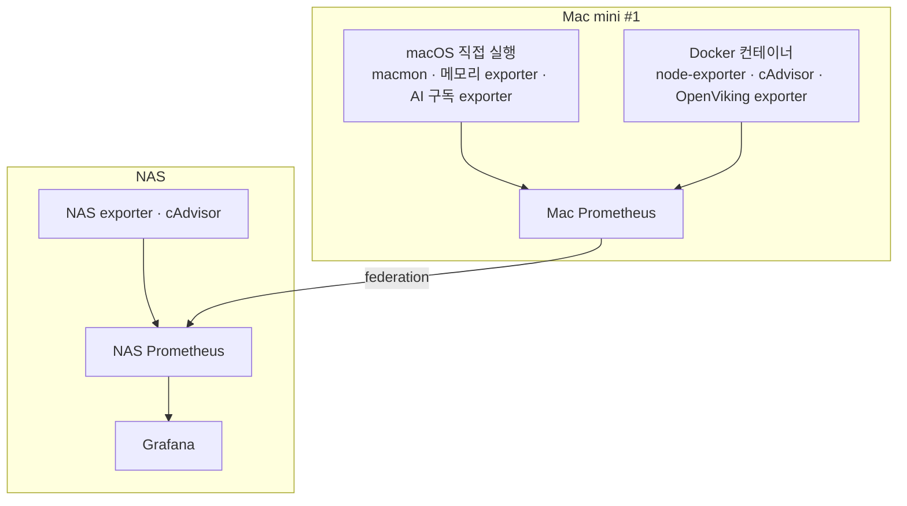

# 홈 AI 인프라 서비스 운영 현황

2026-10-10에 수행한 읽기 전용 점검 결과를 정리했다. NAS의 Docker 컨테이너 29개와 Mac mini #1의 Docker 컨테이너 14개가 점검 당시 모두 실행 중이었다. macOS에서 직접 실행하는 수집기는 별도로 구분했다.

이 문서는 점검 당시의 스냅샷이다. 컨테이너 실행 상태는 개별 서비스의 전체 기능 정상 여부를 보장하지 않는다. 인증 정보, 계정 정보, 장비 고유 식별자, 네트워크 주소, 포트, 로컬 절대 경로, 저장소·이미지의 커밋 식별자는 포함하지 않았다.

## NAS에서 실행 중인 서비스

| 분류 | 서비스 또는 컨테이너 | 역할 |
|---|---|---|
| 웹/API | robingraph-api | RobinGraph 운영 API |
| 웹/API | robingraph-api-test | RobinGraph 테스트 API |
| 자동화 | n8n | 워크플로우 자동화 |
| 자동화 | n8n-runners | n8n 작업 실행 |
| 데이터베이스 | postgres-n8n | n8n·MLflow·RobinGraph 등의 관계형 데이터 저장 |
| 데이터베이스 | postgres-pgbackweb | pgBackWeb용 관계형 데이터 저장 |
| 데이터베이스 | timescaledb | 시계열 데이터 저장 |
| 데이터베이스 | neo4j | 그래프 데이터베이스 |
| 데이터베이스 | redis | 캐시·작업 처리 지원 |
| 모니터링 | grafana | 대시보드·관측성 |
| 모니터링 | prometheus | 메트릭 수집·저장 |
| 모니터링 | node_exporter | NAS 호스트 지표 노출 |
| 모니터링 | cadvisor | 컨테이너 자원 지표 수집 |
| 모니터링 | postgres_exporter | PostgreSQL 지표 노출 |
| 모니터링 | npm-exporter | Nginx Proxy Manager 관련 지표 노출 |
| 모니터링 | orca-exporter | ORCA 관련 수집 서비스 |
| AI 실험 관리 | mlflow | 실험·모델 관리 |
| AI 실험 관리 | mlflow-mcp | MLflow MCP 연동 |
| AI 실험 관리 | mlflow-mcp-http | MLflow MCP HTTP 연동 |
| 지식 관리 | obsidian | 노트·보관함 운영 |
| 지식 관리 | obsidian-git-sync | Obsidian 보관함 Git 동기화 |
| 백업 관리 | pgbackweb | PostgreSQL 백업 관리 |
| 파일·미디어 | filebrowser | 파일 탐색·관리 |
| 파일·미디어 | jellyfin | 미디어 서버 |
| 컨테이너 관리 | portainer | Docker 관리 |
| 프록시 | nginx-proxy-manager | 웹 서비스 프록시 관리 |
| 사설 네트워크 | tailscale-gateway | 사설 네트워크 접속 지원 |
| 사설 네트워크 | tailscale-portainer | Portainer 접속 지원 |
| 사설 네트워크 | tailscale-neo4j | Neo4j 접속 지원 |
| 사설 네트워크 | tailscale-pgbackweb | pgBackWeb 접속 지원 |

### 데이터베이스 확인 결과

- PostgreSQL 두 컨테이너와 TimescaleDB가 각각 실행 중이다.
- 일반 애플리케이션 PostgreSQL 인스턴스에는 여러 서비스의 데이터베이스가 함께 존재한다.
- TimescaleDB에는 pgvector 설치 파일이 제공되지만, 점검한 데이터베이스에는 vector 확장이 활성화되지 않았다.
- 일반 PostgreSQL 두 인스턴스에는 pgvector 설치 파일이 확인되지 않았다.
- Grafana는 애플리케이션 PostgreSQL의 n8n 데이터베이스를 사용하도록 설정되어 있었다. 서비스별 데이터베이스 분리는 검토 사항이다.
- pgBackWeb 실행은 확인했지만, 최근 백업 성공과 복구 가능성은 검증하지 않았다.

## Mac mini #1에서 실행 중인 서비스

### Docker 컨테이너

| 분류 | 서비스 또는 컨테이너 | 역할 |
|---|---|---|
| AI 에이전트 | hermes | Hermes 에이전트 |
| AI 에이전트 | hermes-telemetry | 에이전트 관측 데이터 |
| AI 에이전트 | hermes-dashboard | 에이전트 대시보드 |
| AI 에이전트 | hermes-webui | 에이전트 웹 인터페이스 |
| 지식 서비스 | openviking | 지식·컨텍스트 서비스 |
| 모니터링 | openviking-exporter | OpenViking 지표 노출 |
| 모니터링 | macmini-prometheus | Mac 측 메트릭 수집·저장 |
| 모니터링 | macmini-cadvisor | 컨테이너 자원 지표 수집 |
| 모니터링 | macmini-node-exporter | OrbStack Linux 환경의 시스템 지표 노출 |
| 테스트 환경 | n8n-test | n8n 테스트 |
| 테스트 환경 | n8n-runners-test | 테스트 작업 실행 |
| 테스트 환경 | neo4j-test | Neo4j 테스트 |
| 관리 | portainer-agent | 원격 Docker 관리 지원 |
| 사설 네트워크 | tailscale-hermes-dashboard | Hermes dashboard 접속 지원 |

### macOS에서 직접 실행하는 수집기

| 수집기 | 수집 대상 |
|---|---|
| AI 구독 사용량 exporter | AI 구독 사용률과 수집 상태 |
| macmon | 실제 Mac의 CPU·GPU 사용량, 온도, 전력, 팬 속도 등의 하드웨어 지표 |
| macOS 메모리 exporter | 실제 Mac의 메모리 사용량, 메모리 압박, 스왑 |

실제 프로세스·리스닝 상태 및 Prometheus의 수집 지표로 확인했다. macOS 전체 프로세스 목록은 실행 환경의 제한으로 확인하지 못했으므로, 이 표를 모든 네이티브 앱의 전체 목록으로 해석하지 않는다.

## 모니터링 연결 상태

- Mac Prometheus 수집 대상 7개가 모두 up이었다.
- NAS Prometheus 수집 대상 6개가 모두 up이었다.
- Mac에서 NAS로 지표를 가져오는 Prometheus federation이 up이었다.
- NAS Grafana 상태 API의 데이터베이스 연결이 ok였다.
- AI 구독 수집기의 각 제공자 수집 상태가 정상으로 표시됐다.
- PostgreSQL exporter의 연결 상태 지표가 정상이었다.
- Exporter가 실행 중이라는 사실과 모든 대상의 기능·지표가 검증됐다는 사실은 구분한다.

### 실제 Mac 하드웨어와 Docker 지표의 구분

- 컨테이너형 node-exporter의 운영체제 지표는 OrbStack Linux 환경을 나타냈다.
- macmon과 메모리 exporter는 macOS에서 직접 실행되며 실제 Mac 상태를 수집한다.
- Prometheus는 Docker에서 실행해도 호스트 exporter의 결과를 HTTP로 받아 저장할 수 있다.
- Grafana에서 macmon_*·macos_* 지표와 Linux 환경의 node_* 지표를 구분한다.
- cAdvisor 지표는 개별 컨테이너의 자원 사용량을 파악하는 데 사용한다.

## 자원 및 운영 점검 메모

점검 당시의 단일 측정값이며 지속적인 병목을 확정하는 근거는 아니다.

- NAS 사용 가능 메모리는 약 5.2GiB, 스왑 사용량은 약 3GiB였다.
- 짧은 NAS 측정 구간에는 추가 스왑 입출력이 관측되지 않았다.
- Mac의 메모리 exporter는 스왑 사용량을 0으로 보고했다.
- Mac Neo4j 테스트 컨테이너의 메모리 사용량은 약 5.17GiB였다.
- Mac OpenViking과 Hermes dashboard, NAS ORCA exporter는 메모리 제한 대비 사용률이 높아 추이 관찰 대상이다.
- 해당 세 컨테이너의 현재 OOMKilled 상태는 false였다.
- NAS의 HDD 두 개는 RAID1 구성이고 두 디스크 모두 정상 참여 중이었다.
- 주요 DB 데이터는 NAS의 SSD 볼륨에 저장되어 있었다. 해당 SSD는 단일 디스크이며 디스크 이중화는 없다.
- 주요 점검 대상 컨테이너에는 자동 재시작 정책이 설정되어 있었다. 전체 재부팅 복구 시험은 수행하지 않았다.

## 구성 계획과 실제 운영의 차이

- NAS는 저장·수집 외에도 Neo4j, Redis, 웹/API, MLflow를 운영하고 있다.
- Mac mini #1은 AI 서비스와 함께 n8n·Neo4j 테스트 환경을 운영하고 있다.
- Grafana·Prometheus·exporter와 Mac→NAS 메트릭 전달은 이미 구성되어 있다.
- pgvector는 아직 데이터베이스에서 활성화되지 않았다.
- Mac mini #2는 접속 검증 문제로 점검하지 못했다. 실행 서비스와 상태를 추정하지 않는다.
- 로컬 LLM·학습 환경 및 문서에 있는 다른 계획 서비스는 이번 점검으로 운영 여부를 확정하지 않았다.

## 관련

- [[Dev/인프라/홈 AI 인프라 구성|홈 AI 인프라 구성]]
- [[Dev/index|개발·인프라 인덱스]]
