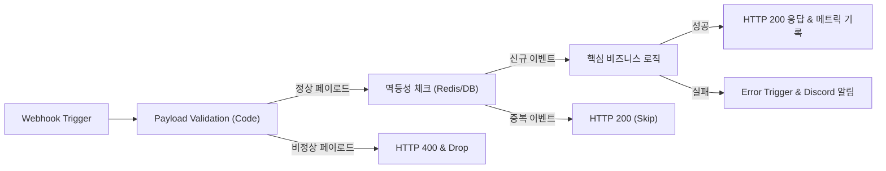

# n8n 워크플로우 신뢰성 및 에러 복구 설계 패턴

## 1. 개요

n8n은 홈랩 및 개인 인프라 자동화에서 강력하지만, 외부 웹훅 연동·비동기 API 호출·재시작 경계에서 실패가 누적되기 쉽다. Birds-Nest 인프라 운영 및 워크플로우 실패율 검증에서 도출된 핵심 설계 패턴과 에러 복구 원칙을 정리한다.

## 2. 워크플로우 실패 주요 원인 패턴

| 실패 유형 | 발생 원인 | 증상 및 지표 | 해결 및 방어 설계 |
|---|---|---|---|
| **웹훅 페이로드 불일치** | 호출처(GitHub, Gmail 등)의 이벤트 타입별 스키마 차이 | `Cannot read property 'x' of undefined` | 상단에 스키마 검증 노드(Switch/Code) 배치, 필수 필드 누락 시 명시적 early-return |
| **비동기 타임아웃** | LLM API 호출 또는 외부 서비스 응답 지연 | 타임아웃 오류 및 재시도 폭주 | n8n 노드 timeout 설정 명시, 백오프(exponential backoff) 재시도 제한 |
| **타임스탬프 누락** | 실행 중단 시 `startedAt` 누락 | 통계 쿼리에서 `startedAt` 누락으로 기간 집계 왜곡 | 집계 시 `COALESCE(stoppedAt, startedAt, createdAt)` 패턴 사용 |
| **상태 비저장성 오류** | 이전 단계 실행 성공을 가정한 노드 체이닝 | 연쇄 실패 (Cascading failure) | 멱등성(Idempotency) 키 검증 및 단계별 상태 저장 |

## 3. 안정적인 웹훅 수신 파이프라인 구조



### 3.1 빠른 응답 vs 지연 처리 분리
* 호출 서비스(GitHub, 알림 봇)는 보통 5~10초 내 HTTP 응답을 요구한다.
* LLM 요약이나 DB 무거운 배치는 웹훅 수신 즉시 `HTTP 200 (Accepted)`을 반환하고 내부 큐/서브 워크플로우(`Execute Workflow`)로 비동기 위임한다.

## 4. 에러 핸들링 설계 원칙

### 4.1 Global Error Trigger 워크플로우 지정
모든 프로덕션 워크플로우는 Settings에서 **Error Trigger Workflow**를 지정해야 한다.
* 에러 트리거 워크플로우 역할:
  1. 실패한 워크플로우 이름, 실행 ID(`$executionId`), 에러 노드, 메시지 수집
  2. 홈랩 Discord 알림 채널에 단일 카드 형식으로 전송
  3. 알림 내부에 n8n 실행 상세 URL(`https://n8n.../execution/{id}`) 첨부

### 4.2 노드 단위 Fail Behavior 선택 기준
* **Continue On Fail**:
  * 외부 텔레메트리/로깅 노드처럼 실패해도 메인 파이프라인에 영향을 주면 안 되는 보조 작업에만 적용.
* **Stop Workflow**:
  * DB 트랜잭션, 인증 토큰 발급, 배포 트리거 등 정합성이 필수적인 핵심 노드에 적용.

## 5. 모니터링 및 통계 쿼리 가이드

n8n PostgreSQL 메타데이터에서 신뢰성 지표를 산출할 때의 표준 SQL 패턴:

```sql
SELECT 
    w.name AS workflow_name,
    count(*) AS total_runs,
    count(*) FILTER (WHERE e.status IN ('error', 'failed')) AS failure_count,
    round(
        count(*) FILTER (WHERE e.status IN ('error', 'failed'))::numeric / count(*)::numeric * 100, 
        2
    ) AS failure_rate_pct
FROM execution_entity e
JOIN workflow_entity w ON e."workflowId" = w.id
WHERE COALESCE(e."stoppedAt", e."startedAt", e."createdAt") >= NOW() - INTERVAL '7 days'
GROUP BY w.id, w.name
ORDER BY failure_count DESC;
```

## 6. 관련 문서

* [[Work/Birds-Nest/작업기록/2026-10-06-n8n-워크플로우-실패율-검증|n8n 워크플로우 실패율 검증 기록]]
* [[Work/Birds-Nest/작업기록/2026-10-08-Carrier-Pigeon-Gmail-바로가기-404-오류-수정과-NAS-n8n-배포|Carrier Pigeon 오류 수정 및 배포 기록]]
* [[Dev/index|Dev 인덱스]]
