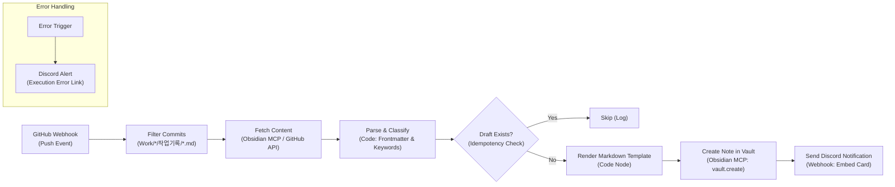

# [작업 명세서] Minerva 지식 증류 파이프라인 n8n 워크플로우 변환 (BN-504 / DEV-202)

## 1. 개요 및 목적
* **배경**: 현재 로컬 Python 스크립트(`scripts/distill_knowledge.py`)로 구현된 Minerva 지식 증류(Work 작업기록 → Dev 상록수 노트 초안 생성) 로직을 **n8n 기반의 이벤트 드리븐 자동화 워크플로우**로 전면 전환한다.
* **목적**:
  1. 수동 CLI 실행 의존성을 제거하고, GitHub Push 또는 정기 스케줄에 따라 신규 `Work/` 기록을 자동 감지한다.
  2. [[Dev/자동화/n8n-워크플로우-신뢰성-및-에러-복구-패턴|n8n 워크플로우 신뢰성 패턴]]을 준수하여 멱등성 및 장애 복구력을 확보한다.
  3. 초안 생성 후 Obsidian MCP / Git 및 Discord 알림을 통해 작업자에게 즉시 피드백을 제공한다.

---

## 2. 기존 Python 스크립트 분석 및 요구사항 매핑

| 기능 영역 | 기존 Python 스크립트 (`distill_knowledge.py`) | n8n 워크플로우 매핑 노드/로직 |
|---|---|---|
| **트리거 (Trigger)** | CLI 인자 (`--file`, `--recent-days`) | 1) GitHub Push Webhook (신규 커밋 감지)<br>2) Schedule Trigger (매일 자정 보완 검사)<br>3) Manual/Test Webhook |
| **파일 필터링** | `Work/*/작업기록/*.md` 정규식 및 mtime 검사 | GitHub commits diff 필터 또는 Code 노드 (정규표현식 매칭) |
| **문서 파싱** | Frontmatter(YAML) 분리, 본문 분리, H1 제목 추출 | Code 노드 (Regex / YAML 파서) 또는 Obsidian MCP `vault.read` |
| **도메인 분류** | 5대 핵심 기술 키워드 매칭 기반 도메인 분류 | Switch 노드 + Code 노드 (키워드 매칭) + 옵션 LLM 노드 |
| **Dev 카테고리 라우팅** | `인프라/`, `자동화/`, `관측성/`, `데이터/` 매핑 | Rule-based Routing (Switch 노드) |
| **초안 문서 생성** | 템플릿 마크다운 렌더링 (`초안-<slug>.md`) | Markdown Template Code 노드 |
| **볼트 쓰기 (Write)** | 로컬 파일시스템 직접 쓰기 | 1) Obsidian MCP (`vault.create`) 또는<br>2) GitHub API (Create/Update file path) |
| **알림 (Notification)** | 콘솔 stdout 출력 | Discord Webhook (Rich Embed 카드 전송) |

---

## 3. n8n 워크플로우 아키텍처 및 노드 파이프라인



### 3.1. 단계별 세부 노드 구성

#### [Node 1] 트리거부 (Webhook / Schedule)
- **WebHook Node (Primary)**:
  - Path: `/webhook/minerva-distill`
  - Method: `POST`
  - Event: GitHub `push` 이벤트 페이로드 수신.
- **Schedule Trigger (Secondary / Fallback)**:
  - Cron: `0 3 * * *` (매일 새벽 3시 실행, 최근 24시간 내 누락 파일 일괄 검사).

#### [Node 2] 파일 경로 검증 및 필터 (Code Node)
- **로직**:
  - `commits[].added` 및 `commits[].modified` 배열을 순회.
  - 경로 패턴 `^Work/([^/]+)/작업기록/(.+)\.md$` 정규식 매치.
  - 일치하는 파일 목록만 다음 노드로 반환 (없으면 조기 종료).

#### [Node 3] 원천 문서 읽기 (Obsidian MCP / GitHub Contents API)
- **Obsidian MCP 노드**:
  - Endpoint: `http://obsidian:3443/mcp` (또는 내부 MCP 도구 연동)
  - Tool: `vault.read`
  - Parameter: `path: "Work/..."`
- *대체 수단*: 로컬 볼트 마운트 경로 직접 접근 또는 GitHub API `GET /repos/:owner/:repo/contents/:path`.

#### [Node 4] 지식 분석 및 카테고리 판별 (Code Node)
- **Frontmatter 파싱**: YAML 헤더 분리 (`tags`, `project`, `id`, `date` 등).
- **제목 추출**: 첫 번째 `# ` 라인 또는 파일 stem.
- **키워드 매칭 사전**:
  ```javascript
  const keywords = {
    '인프라': ['tailscale', 'dns', 'cloudflare', '인증서', 'origin', "let's encrypt", 'npm', 'gateway'],
    '자동화': ['n8n', 'webhook', '웹훅', 'workflow', '실패율', '파이프라인', '자동화'],
    '관측성': ['token', '토큰', 'cache', '캐시', 'grafana', 'prometheus', 'mlflow', 'telemetry'],
    '데이터': ['neo4j', 'cypher', '지식그래프', '계통', 'taxo', 'timescaledb', 'postgresql']
  };
  ```
- **카테고리 결정**: 매칭된 키워드 가중치 기반으로 4대 폴더(`인프라`, `자동화`, `관측성`, `데이터`) 및 ID 접두사(`DEV-1xx`~`DEV-4xx`) 확정.

#### [Node 5] 멱등성 검사 (Idempotency Check)
- 목적: 동일 작업 기록에 대해 초안이 이미 생성되어 있을 경우 중복 생성 방지.
- 방법:
  - 대상 경로: `Dev/<카테고리>/초안-<파일명_날짜제거>.md`
  - Obsidian MCP `vault.read` 또는 파일 존재 여부 확인.
  - 파일이 이미 존재하면 `status: already_exists`로 분기하여 생성 스킵.

#### [Node 6] 초안 마크다운 렌더링 (Code Node)
- **YAML Frontmatter 규격**:
  ```yaml
  ---
  created: YYYY-MM-DD
  updated: YYYY-MM-DD
  type: reference
  category: {카테고리명}
  status: draft
  source_project: {프로젝트명}
  source_work_log: "[[{원천_파일_상대경로}]]"
  tags:
    - dev
    - draft
    - {프로젝트_소문자}
  ---
  ```
- **본문 표준 섹션**:
  - `## 1. 개요 및 목적`
  - `## 2. 핵심 아키텍처 및 원칙`
  - `## 3. 재사용 가능한 코드 스니펫 / 설정` (원천 문서 내 코드 블록 자동 복사/배치)
  - `## 4. 검증 근거 및 트러블슈팅`
  - `## 5. 관련 Dev 가이드`

#### [Node 7] 옵시디언 볼트 반영 (Obsidian MCP Node)
- Tool: `vault.create`
- Arguments:
  - `path`: `Dev/{카테고리}/초안-{slug}.md`
  - `content`: 생성된 마크다운 텍스트
  - `overwrite`: `false`

#### [Node 8] Discord 알림 전송 (Discord Webhook Node)
- **형식**: Rich Embed
- **포함 필드**:
  - 제목: `💡 새 Dev 지식 증류 초안 생성 알림`
  - 필드 1: `원천 작업기록`: `[{프로젝트}] {제목}`
  - 필드 2: `분류 카테고리`: `Dev/{카테고리}/`
  - 필드 3: `생성 파일`: `Dev/{카테고리}/초안-{slug}.md`
  - 필드 4: `Obsidian 바로가기`: `obsidian://open?vault=Minerva&file=Dev%2F{카테고리}%2F초안-{slug}`
  - 컬러: `#4A90E2` (초안 생성) / `#E74C3C` (실패 시)

---

## 4. 신뢰성 및 예외 처리 정책 ([[Dev/자동화/n8n-워크플로우-신뢰성-및-에러-복구-패턴]] 준수)

1. **에러 트리거(Error Trigger) 필수 연결**:
   - 워크플로우 실행 중 실패 발생 시 글로벌 Error Trigger 노드가 활성화되어 장애 알림 발송.
   - 알림에 `{{$execution.id}}`, 에러 노드명, 에러 메시지 포함.
2. **비동기 타임아웃 및 재시도**:
   - Obsidian MCP 호출 노드 타임아웃 10초 설정, 2회 재시도 (간격 3초).
3. **스키마 방어**:
   - Webhook 페이로드에 `commits` 배열이 없거나 빈 배열일 경우 조기 정상 종료 (`200 OK`).
4. **Git 충돌 방지**:
   - 파일 생성은 옵시디언 볼트 로컬/MCP를 통해 단일 작성되도록 하며, 볼트의 자동 Git Sync(Magpie/Obsidian Git)가 다음 커밋 주기에 자동으로 원격으로 푸시하도록 구성.

---

## 5. 단계별 구현 및 검증 체크리스트

- [ ] **Step 1: n8n 워크플로우 캔버스 생성**
  - 워크플로우명: `[Minerva] Knowledge Distillation Pipeline`
  - 태그: `minerva`, `knowledge`, `distill`, `obsidian`
- [ ] **Step 2: Credential & MCP 연결 확인**
  - NAS Obsidian MCP (`http://obsidian:3443/mcp`) 통신 및 `vault.read` / `vault.create` 정상 동작 검증.
  - Discord Webhook URL Credential 등록.
- [ ] **Step 3: 목(Mock) 데이터 단위 테스트**
  - `Work/RobinGraph/작업기록/2xx 검색·RAG·그래프 질의/2026-10-06-전체종-근연관계우선-계통근거-NAS배포.md` 경로를 페이로드로 주입하여 카테고리 판별(`데이터`), 초안 생성, Discord 알림 동작 확인.
- [ ] **Step 4: 멱등성(중복 생성 방지) 검증**
  - 동일한 파일로 2회 연속 트리거 시 두 번째 실행에서는 생성을 스킵하고 정상 종료되는지 확인.
- [ ] **Step 5: 에러 주입 테스트**
  - 잘못된 파일 경로 주입 시 Error Trigger가 발동하여 Discord로 실패 카드가 전송되는지 확인.
- [ ] **Step 6: 실 운영 GitHub Webhook 연동**
  - Minerva GitHub 리포지토리 Settings → Webhooks에 n8n 프로덕션 웹훅 등록.

---

## 6. 관련 문서
- 원천 스크립트: `scripts/distill_knowledge.py`
- 백로그 항목: [[Work/Birds-Nest/Birds-Nest 작업 백로그#BN-504 — Woodpecker n8n 기반 지식 증류 자동 추천 웹훅 구축|BN-504 지식 증류 웹훅 구축]]
- 참조 패턴: [[Dev/자동화/n8n-워크플로우-신뢰성-및-에러-복구-패턴|DEV-201 n8n 워크플로우 신뢰성 및 에러 복구 패턴]]
- Dev 인덱스: [[Dev/index|Dev 인덱스]]
