# Jev AI 및 Gemini 기반 Carrier Pigeon 워크플로우 개편과 프로덕션 배포

## 요약

Gmail 수신 알림 및 메일 처리 자동화 워크플로우인 `[mail alarm] carrier pigeon`을 기존의 무거운 LangChain 및 PostgreSQL 다이제스트 큐 방식에서 경량 고속 모델인 **Jev AI (`typesafe/jev-1.13`)** 기반 실시간 분류 체계로 전면 리팩토링했다.

기존에 유지되던 복잡한 DB 기반 뉴스레터 큐잉 및 다이제스트 배치 로직을 걷어내어 워크플로우를 간소화했으며, 채용 제안(`job-offer`)의 구글 캘린더 자동 등록/Discord 알림, 보안 인증(`authorization`) 즉시 발송, 마케팅/스팸(`spam`) 자동 읽음 처리의 3대 경로로 단순화했다.

추가로 누락되었던 **PyTorch Korea (`https://discuss.pytorch.kr/c/news/14.rss`) RSS 수집·분류·요약 파이프라인**을 복원하며, 분류기를 Gmail과 동일하게 **Jev AI (`typesafe/jev-1.13`)** 고속 분류기로 통합 구성했다. 본문 요약 및 주간 논문 정보 추출은 Google Gemini 최신 모델(`gemini-3.5-flash`)을 연동했다.

이후 테스트 도메인(`workflow-test.dove-nest.com`)을 정리하고 `n8n-test`를 로컬 바인딩(`localhost:5678`)으로 원복한 뒤, 최종 워크플로우를 **NAS 운영(Production) n8n 환경**에 직접 배포 및 활성화(`Active: True`, 총 27개 노드) 완료했다.

## 완료 결과

| 구분 | 변경 사항 | 상세 내용 |
| --- | --- | --- |
| **메일 분류 경량화** | Jev AI 분류기 전환 | LangChain Text Classifier 및 OpenRouter 노드 제거 → Jev AI SystemOne API(`https://thejevai.com/v1/systemone`) 직접 호출 노드로 교체 |
| **카테고리 라우팅** | 3대 분기 파이프라인 정리 | `job-offer`(채용 제안), `authorization`(보안 인증), `spam`(광고/뉴스레터) 3개 카테고리로 명확히 분기 |
| **DB 큐잉 제거** | PostgreSQL 다이제스트 노드 삭제 | `Claim Event Dedup Key`, `Durably Enqueue Newsletter`, `Digest Schedule` 등 불필요한 DB 큐잉 로직 1,180라인 제거 |
| **캘린더 자동 등록** | 채용 제안 자동 일정화 | `job-offer` 메일 수신 시 지원 마감일/면접 일정을 추출해 Google Calendar 등록 및 Discord 알림 발송 |
| **PyTorch Korea Jev AI 분류** | Jev AI RSS 분류기 적용 | `discuss.pytorch.kr` RSS 트리거 복원, `typesafe/jev-1.13` 기반 본문 분류(Agent/Robotics/WeeklyPaper/misc) 적용 |
| **기사 요약 & 논문 추출** | Gemini 3.5 Flash 연동 | Agent/Robotics 기사는 300자 요약, WeeklyPaper는 JSON 스키마 기반 논문 목록 추출 후 Discord `뉴스-다이제스트` 전송 |
| **프로덕션 배포** | NAS n8n 프로덕션 적용 | `workflow.dove-nest.com` 프로덕션 DB에 워크플로우 임포트 및 활성화(`Active: True`, 총 27개 노드) 완료 |
| **테스트 스택 정리** | 로컬 localhost 원복 | `workflow-test.dove-nest.com` 제거에 맞춰 `n8n-test`를 `127.0.0.1:5678` 로컬 환경으로 원복 및 재기동 |
| **문서 및 지식 그래프** | README & Graphify 갱신 | `README.md` 워크플로우 및 테스트베드 설명 반영, 지식 그래프 동기화 완료 |

## 워크플로우 구조 및 흐름

```mermaid
flowchart TD
    subgraph Gmail_Flow["1. Gmail 알람 및 처리 (Jev AI)"]
        A["Unread Gmail Trigger<br/>(kimhippowork 메일)"] --> B["Jev AI Classifier<br/>(typesafe/jev-1.13)"]
        B --> C["Attach Jev Category<br/>(정규화 Code 노드)"]
        C --> D{"Route by Category<br/>(Switch 노드)"}
        
        D -- "job-offer" --> E["Validate & Dedupe Candidates"]
        E --> F{"Has Clear Calendar Events"}
        F -- "Yes" --> G["Split Clear Events"]
        G --> H["Create Calendar Event<br/>(Google Calendar)"]
        H --> I["Job Offer Created Discord"]
        F -- "No" --> J["Job Offer Review Discord"]
        
        D -- "authorization" --> K["Authentication Safe Discord<br/>(인증코드 즉시 전송)"]
        D -- "spam" --> L["Mark Promotional Spam Read<br/>(자동 읽음 처리)"]
    end

    subgraph PyTorch_Flow["2. PyTorch Korea 커뮤니티 뉴스 (Jev AI + Gemini)"]
        P1["PyTorch Korea 게시글 가져오기<br/>(discuss.pytorch.kr/c/news/14.rss)"] --> P2["필수 데이터 정리<br/>(title, link, content)"]
        P2 --> P3["Jev AI RSS Classifier<br/>(typesafe/jev-1.13)"]
        P3 --> P4["Attach Jev RSS Category<br/>(정규화 Code 노드)"]
        P4 --> P5{"Route RSS by Category<br/>(Switch 노드)"}
        
        P5 -- "Agent / Robotics" --> P6["RSS 본문 요약<br/>(Gemini 3.5 Flash 300자 요약)"]
        P6 --> P7["디코에 보내기<br/>(NestControl 뉴스-다이제스트)"]
        
        P5 -- "WeeklyPaper" --> P8["주간 논문 제목, 요약<br/>(Gemini 3.5 Flash JSON 추출)"]
        P8 --> P7
        
        P5 -- "misc" --> P9["No Operation<br/>(미처리)"]
    end
```



## 주요 구현 상세

### 1. Jev AI SystemOne API 연동

#### (1) Gmail 수신 메일 분류 (`Jev AI Classifier`)
* **엔드포인트:** `POST https://thejevai.com/v1/systemone`
* **모델:** `typesafe/jev-1.13`
* **카테고리:** `job-offer`, `authorization`, `spam`

#### (2) PyTorch Korea 커뮤니티 게시글 분류 (`Jev AI RSS Classifier`)
* **엔드포인트:** `POST https://thejevai.com/v1/systemone`
* **모델:** `typesafe/jev-1.13`
* **요청 바디 구성:**
  ```json
  {
    "model": "typesafe/jev-1.13",
    "state": "제목: {{ $json.title }}\n본문: {{ $json.content }}",
    "questions": {
      "category": {
        "type": "choice",
        "instructions": "PyTorch Korea 커뮤니티 게시글의 주제에 가장 부합하는 카테고리를 선택하세요.",
        "criteria": {
          "Agent": "LLM, RAG, 혹은 AI Agent와 관련된 내용의 기사나 소식",
          "Robotics": "Physical AI 혹은 로보틱스 모델과 관련된 내용의 기사나 소식",
          "WeeklyPaper": "주간 읽을만한 논문 목록 또는 논문 큐레이션",
          "misc": "기타 일반 토론, 공지사항, 단순 질의응답 등"
        }
      }
    }
  }
  ```

### 2. 본문 요약 및 논문 구조화 (Gemini 3.5 Flash)

* **요약 및 논문 추출 모델:** `models/gemini-3.5-flash` (`@n8n/n8n-nodes-langchain.lmChatGoogleGemini`)
  * AI 전문 기자 관점의 300자 한국어 핵심 요약 및 키워드 구조화
  * 주간 논문 제목/요약 목록 JSON Schema 기반 정밀 추출
* **Discord 전송:** `NestControl` (`1504129603310981120`)의 `뉴스-다이제스트` (`1520625408549064845`) 채널로 자동 발송

### 3. 프로덕션 배포 및 테스트 스택 정리

* **NAS 프로덕션 배포:**
  * 대상 DB: `postgres-n8n` (`n8n` database)
  * 워크플로우 ID: `lAhoIgivFiB59z8p` (`[mail alarm] carrier pigeon`)
  * 반영 결과: 27개 노드 전체 임포트 및 `publish:workflow` 완료 (`active: true`)
* **Mac mini n8n-test 스택:**
  * `workflow-test.dove-nest.com` 제거에 따라 `127.0.0.1:5678` 로컬 포트 바인딩으로 원복 및 컨테이너 재기동 완료.

## 관련 링크

- [[Work/Birds-Nest/index|Birds-Nest 프로젝트 인덱스]]
- [[Work/index|토이 프로젝트 목록]]
- [[Home]]
