# Jev AI 및 Gemini 기반 Carrier Pigeon 워크플로우 개편과 n8n 테스트베드 구축

## 요약

Gmail 수신 알림 및 메일 처리 자동화 워크플로우인 `[mail alarm] carrier pigeon`을 기존의 무거운 LangChain 및 PostgreSQL 다이제스트 큐 방식에서 경량 고속 모델인 **Jev AI (`typesafe/jev-1.13`)** 기반 실시간 분류 체계로 전면 리팩토링했다.

기존에 유지되던 복잡한 DB 기반 뉴스레터 큐잉 및 다이제스트 배치 로직을 걷어내어 워크플로우를 간소화했으며, 채용 제안(`job-offer`)의 구글 캘린더 자동 등록/Discord 알림, 보안 인증(`authorization`) 즉시 발송, 마케팅/스팸(`spam`) 자동 읽음 처리의 3대 경로로 단순화했다.

추가로 로컬 `n8n-test`에서 누락되었던 **PyTorch Korea (`https://discuss.pytorch.kr/c/news/14.rss`) RSS 수집·분류·요약 파이프라인**을 복원하면서, 기존 OpenRouter 무료 모델 대신 Google Gemini 최신 모델(`gemini-3.1-flash-lite`, `gemini-3.5-flash`)로 분류 및 요약을 고도화하여 워크플로우에 통합했다.

또한 Mac mini 환경에서 워크플로우를 안전하게 사전 검증할 수 있도록 `n8n-test` 도커 환경의 외부 프록시 바인딩 및 NPM(Nginx Proxy Manager) 도메인(`workflow-test.dove-nest.com`) 연동 설정을 완료하고 리포지토리 문서와 지식 그래프를 갱신했다.

## 완료 결과

| 구분 | 변경 사항 | 상세 내용 |
| --- | --- | --- |
| **메일 분류 경량화** | Jev AI 분류기 전환 | LangChain Text Classifier 및 OpenRouter 노드 제거 → Jev AI SystemOne API(`https://thejevai.com/v1/systemone`) 직접 호출 노드로 교체 |
| **카테고리 라우팅** | 3대 분기 파이프라인 정리 | `job-offer`(채용 제안), `authorization`(보안 인증), `spam`(광고/뉴스레터) 3개 카테고리로 명확히 분기 |
| **DB 큐잉 제거** | PostgreSQL 다이제스트 노드 삭제 | `Claim Event Dedup Key`, `Durably Enqueue Newsletter`, `Digest Schedule` 등 불필요한 DB 큐잉 로직 1,180라인 제거 |
| **캘린더 자동 등록** | 채용 제안 자동 일정화 | `job-offer` 메일 수신 시 지원 마감일/면접 일정을 추출해 Google Calendar 등록 및 Discord 알림 발송 |
| **PyTorch Korea 통합** | RSS 피드 & Gemini 고도화 복원 | `discuss.pytorch.kr` RSS 트리거 복원, `gemini-3.1-flash-lite` 본문 분류(Agent/Robotics/WeeklyPaper), `gemini-3.5-flash` 기사 요약 및 논문 추출 후 Discord `뉴스-다이제스트` 전송 |
| **테스트 인프라** | `n8n-test` 역방향 프록시 연동 | Mac mini 로컬 n8n 테스트베드에 NPM 프록시(`workflow-test.dove-nest.com`, HTTPS, `N8N_PROXY_HOPS: 1`) 적용 |
| **문서 및 지식 그래프** | README & Graphify 갱신 | `README.md`에 Jev AI + Gemini 워크플로우 및 테스트베드 커맨드 반영, 지식 그래프 동기화 머지 완료 |

## 워크플로우 구조 및 흐름

```mermaid
flowchart TD
    subgraph Gmail_Flow["1. Gmail 알람 및 처리 (Jev AI)"]
        A["Unread Gmail Trigger<br/>(kimhippowork 메일)"] --> B["Jev AI Classifier<br/>(typesafe/jev-1.13)"]
        B --> C["Attach Jev Category<br/>(정규화 Code 노드)"]
        C --> D{"Route by Category<br/>(Switch 노드)"}
        
        D -- "job-offer" --> E["Validate & Dedupe Candidates"]
        E --> F{"Has Clear Calendar Events"}
        F -- "Yes" --> G["Split Clear Events"]
        G --> H["Create Calendar Event<br/>(Google Calendar)"]
        H --> I["Job Offer Created Discord"]
        F -- "No" --> J["Job Offer Review Discord"]
        
        D -- "authorization" --> K["Authentication Safe Discord<br/>(인증코드 즉시 전송)"]
        D -- "spam" --> L["Mark Promotional Spam Read<br/>(자동 읽음 처리)"]
    end

    subgraph PyTorch_Flow["2. PyTorch Korea 커뮤니티 뉴스 (Gemini)"]
        P1["PyTorch Korea 게시글 가져오기<br/>(discuss.pytorch.kr/c/news/14.rss)"] --> P2["필수 데이터 정리<br/>(title, link, content)"]
        P2 --> P3["RSS 본문 분류기<br/>(Gemini 3.1 Flash Lite)"]
        
        P3 -- "Agent / Robotics" --> P4["RSS 본문 요약<br/>(Gemini 3.5 Flash 300자 요약)"]
        P4 --> P5["디코에 보내기<br/>(NestControl 뉴스-다이제스트)"]
        
        P3 -- "WeeklyPaper" --> P6["주간 논문 제목, 요약<br/>(Gemini 3.5 Flash JSON 추출)"]
        P6 --> P5
        
        P3 -- "misc" --> P7["No Operation<br/>(미처리)"]
    end
```

## 주요 구현 상세

### 1. Jev AI SystemOne API 연동 (메일 분류)

* **엔드포인트:** `POST https://thejevai.com/v1/systemone`
* **모델:** `typesafe/jev-1.13`
* **카테고리:** `job-offer`, `authorization`, `spam`

### 2. PyTorch Korea 커뮤니티 RSS 수집 및 Gemini 고도화

기존 OpenRouter 무료 모델(`liquid`, `nemotron`)의 불안정성을 해소하기 위해 프로덕션 Google Gemini 모델로 전면 교체:

* **RSS 트리거:** `https://discuss.pytorch.kr/c/news/14.rss` (1분 주기 감지)
* **본문 분류기 모델:** `models/gemini-3.1-flash-lite` (`@n8n/n8n-nodes-langchain.lmChatGoogleGemini`)
  * `Agent`: LLM, RAG, Agent 관련 기사
  * `Robotics`: Physical AI, 로보틱스 관련 기사
  * `WeeklyPaper`: 주간 논문 모음
  * `misc`: 기타
* **요약 및 논문 추출 모델:** `models/gemini-3.5-flash`
  * AI 전문 기자 관점의 300자 한국어 핵심 요약 및 키워드 구조화
  * 주간 논문 제목/요약 목록 JSON Schema 기반 정밀 추출
* **Discord 전송:** `NestControl` (`1504129603310981120`)의 `뉴스-다이제스트` (`1520625408549064845`) 채널로 자동 발송

### 3. Mac mini `n8n-test` 역방향 프록시 설정

`docker-compose/n8n-test/docker-compose.yml`에서 호스트 루프백 바인딩을 열고 Nginx Proxy Manager 도메인 설정을 주입:

* `ports`: `"${N8N_TEST_PORT:-5678}:5678"`
* `N8N_HOST`: `workflow-test.dove-nest.com`
* `N8N_PROTOCOL`: `https`
* `N8N_EDITOR_BASE_URL`: `https://workflow-test.dove-nest.com`
* `WEBHOOK_URL`: `https://workflow-test.dove-nest.com/`
* `N8N_PROXY_HOPS`: `"1"`

## 관련 링크

- [[Work/Birds-Nest/index|Birds-Nest 프로젝트 인덱스]]
- [[Work/index|토이 프로젝트 목록]]
- [[Home]]
