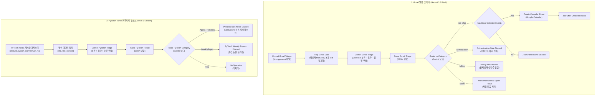

# Google Gemini 기반 Carrier Pigeon 워크플로우 개편 및 프로덕션 배포

## 요약

Gmail 수신 알림 및 메일 처리 자동화 워크플로우인 `[mail alarm] carrier pigeon`을 기존의 불안정했던 Jev AI 분류기에서 **Google Gemini (`models/gemini-3.5-flash`) 단일 샷(One-Shot) 파이프라인**으로 전면 전환했다.

실제 운영 중 발생했던 **발신자 `[object Object]` 표기 버그**와 **본문 누락 `(본문 없음)` 버그**를 완전히 해결했으며, 대량 광고 메일(`(광고) [크라우드웍스]...`)이나 결제 실패 메일(`Discord 결제 실패`)이 엉뚱한 채용/인증 알림으로 오분류되던 문제를 해결했다. 카테고리도 `job-offer`, `authorization`, `billing`, `spam`, `misc`의 현실적인 5대 체계로 확장했다.

또한 **PyTorch Korea 커뮤니티 RSS (`https://discuss.pytorch.kr/c/news/14.rss`)** 파이프라인 역시 동일하게 Gemini 3.5 Flash 엔진으로 통일하여, 기술 뉴스(`Agent`, `Robotics`) 300자 요약 및 주간 논문(`WeeklyPaper`) 구조화 추출 후 Discord 채널로 전송하도록 구성했다.

테스트 도메인 정리 후 최종 워크플로우를 **NAS 운영(Production) n8n 환경**에 직접 배포 및 활성화(`Active: True`, 총 26개 노드) 완료했다.

## 완료 결과

| 구분 | 변경 사항 | 상세 내용 |
| --- | --- | --- |
| **분류 엔진 통합** | Jev AI 퇴출 → Gemini 단일 샷 전환 | 오분류와 빈 본문 문제를 야기하던 Jev AI HTTP 노드를 완전히 제거하고, Gemini 3.5 Flash를 통해 [분류 + 요약 + 캘린더 일시 추출]을 1회 호출로 종결 |
| **메일 파싱 버그 수정** | 발신자 & 본문 정상화 | • 발신자: `$json.from.text` 파싱으로 `[object Object]` 해결<br>• 본문: Gmail 트리거의 `text` 필드를 정상 참조하여 `(본문 없음)` 해결 |
| **카테고리 체계 확장** | 5대 정밀 분류 프롬프트 적용 | • `job-offer`: 실제 1:1 채용/면접 메일만 해당 (`(광고)`는 철저 배제)<br>• `authorization`: 2FA 보안 인증 코드<br>• `billing`: 결제 실패, 정기 결제, 영수증 (신규 추가)<br>• `spam`: 광고, 뉴스레터 (자동 읽음 처리)<br>• `misc`: 기타 중요 알림 |
| **캘린더 연동 고도화** | Gemini 기반 일시 추출 | 정규식 대신 Gemini가 메일 본문에서 면접 일시(ISO 8601)를 직접 추출하여 Google Calendar 등록 및 Discord 알림 발송 |
| **PyTorch Korea 통합** | Gemini 3.5 Flash 요약 및 논문 추출 | RSS 피드 수집 후 Gemini 3.5 Flash로 분류 및 요약(300자 내외 핵심 및 시사점)과 주간 논문 목록을 추출해 Discord `뉴스-다이제스트` 전송 |
| **프로덕션 배포** | NAS n8n 프로덕션 적용 | `workflow.dove-nest.com` 프로덕션 DB에 워크플로우 임포트 및 활성화(`Active: True`, 총 26개 노드) 완료 |
| **테스트 스택 정리** | 로컬 localhost 원복 | `workflow-test.dove-nest.com` 제거에 맞춰 `n8n-test`를 `127.0.0.1:5678` 로컬 환경으로 원복 및 재기동 |
| **문서 및 지식 그래프** | README & Graphify 갱신 | `README.md` 워크플로우 및 테스트베드 설명 반영, 지식 그래프 동기화 완료 |

## 워크플로우 구조 및 흐름



## 주요 구현 상세

### 1. 발신자 및 본문 추출 로직 (`Prep Gmail Data`)

```javascript
const items = $input.all();
return items.map(item => {
  const raw = item.json || {};
  let fromText = '';
  if (raw.from) {
    if (typeof raw.from === 'string') {
      fromText = raw.from;
    } else if (raw.from.text) {
      fromText = raw.from.text;
    } else if (Array.isArray(raw.from.value) && raw.from.value[0]?.address) {
      const v = raw.from.value[0];
      fromText = v.name ? `${v.name} <${v.address}>` : v.address;
    } else {
      fromText = JSON.stringify(raw.from);
    }
  }

  const subject = raw.subject || '(제목 없음)';
  const bodyText = (raw.text || raw.snippet || raw.html || '').slice(0, 3000);

  return { json: { ...raw, fromText, subject, bodyText } };
});
```

### 2. Gemini One-shot 프롬프트 (분류 + 요약 + 일정)

* **모델:** `models/gemini-3.5-flash` (`Gemni API 키 프로덕션`)
* **핵심 지침:**
  * `(광고)`, `[광고]` 또는 대량 모집성 메일은 무조건 `spam`으로 강제 분류하여 캘린더 등록 오류 원천 차단.
  * `Discord 결제 실패`, 구독 갱신 등의 결제 메일은 `billing` 카테고리로 명확히 분리하여 자물쇠(인증) 알림 오발송 방지.
  * 면접 일정이 명확한 경우에만 ISO 8601 일시 추출.

### 3. 프로덕션 배포 결과

* **NAS 프로덕션 배포:**
  * 대상 DB: `postgres-n8n` (`n8n` database)
  * 워크플로우 ID: `lAhoIgivFiB59z8p` (`[mail alarm] carrier pigeon`)
  * 반영 결과: 26개 노드 전체 임포트 및 `publish:workflow` 완료 (`active: true`)
* **Mac mini n8n-test 스택:**
  * `127.0.0.1:5678` 로컬 포트 바인딩으로 원복 및 컨테이너 정상 가동 중.

## 관련 링크

- [[Work/Birds-Nest/index|Birds-Nest 프로젝트 인덱스]]
- [[Work/index|토이 프로젝트 목록]]
- [[Home]]
