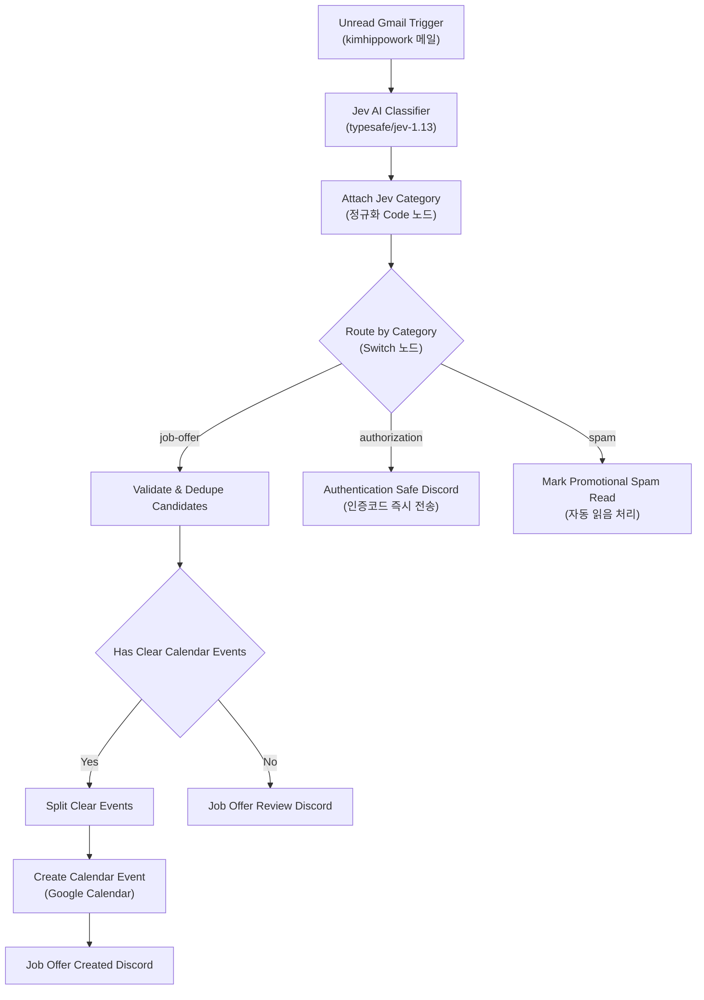

# Jev AI 기반 Carrier Pigeon 워크플로우 개편과 n8n 테스트베드 구축

## 요약

Gmail 수신 알림 및 메일 처리 자동화 워크플로우인 `[mail alarm] carrier pigeon`을 기존의 무거운 LangChain 및 PostgreSQL 다이제스트 큐 방식에서 경량 고속 모델인 **Jev AI (`typesafe/jev-1.13`)** 기반 실시간 분류 체계로 전면 리팩토링했다.

기존에 유지되던 복잡한 DB 기반 뉴스레터 큐잉 및 다이제스트 배치 로직을 걷어내어 워크플로우 크기를 1,180줄 이상 축소했으며, 채용 제안(`job-offer`)의 구글 캘린더 자동 등록/Discord 알림, 보안 인증(`authorization`) 즉시 발송, 마케팅/스팸(`spam`) 자동 읽음 처리의 3대 경로로 단순화했다.

또한 Mac mini 환경에서 워크플로우를 안전하게 사전 검증할 수 있도록 `n8n-test` 도커 환경의 외부 프록시 바인딩 및 NPM(Nginx Proxy Manager) 도메인(`workflow-test.dove-nest.com`) 연동 설정을 완료하고 리포지토리 문서와 지식 그래프를 갱신했다.

## 완료 결과

| 구분 | 변경 사항 | 상세 내용 |
| --- | --- | --- |
| **워크플로우 경량화** | Jev AI 분류기 전환 | LangChain Text Classifier 및 OpenRouter 노드 제거 → Jev AI SystemOne API(`https://thejevai.com/v1/systemone`) 직접 호출 노드로 교체 |
| **카테고리 라우팅** | 3대 분기 파이프라인 정리 | `job-offer`(채용 제안), `authorization`(보안 인증), `spam`(광고/뉴스레터) 3개 카테고리로 명확히 분기 |
| **DB 큐잉 제거** | PostgreSQL 다이제스트 노드 삭제 | `Claim Event Dedup Key`, `Durably Enqueue Newsletter`, `Digest Schedule` 등 불필요한 DB 큐잉 로직 1,180라인 제거 |
| **캘린더 자동 등록** | 채용 제안 자동 일정화 | `job-offer` 메일 수신 시 지원 마감일/면접 일정을 추출해 Google Calendar 등록 및 Discord 알림 발송 |
| **테스트 인프라** | `n8n-test` 역방향 프록시 연동 | Mac mini 로컬 n8n 테스트베드에 NPM 프록시(`workflow-test.dove-nest.com`, HTTPS, `N8N_PROXY_HOPS: 1`) 적용 |
| **문서 및 지식 그래프** | README & Graphify 갱신 | `README.md`에 Jev AI 워크플로우 및 테스트베드 커맨드 반영, 지식 그래프 동기화 머지 완료 |

## 워크플로우 구조 및 흐름



## 주요 구현 상세

### 1. Jev AI SystemOne API 연동

LangChain 노드 번들을 사용하는 대신 단일 HTTP Request 노드로 경량화했다:

* **엔드포인트:** `POST https://thejevai.com/v1/systemone`
* **모델:** `typesafe/jev-1.13`
* **요청 바디 구성:**
  ```json
  {
    "model": "typesafe/jev-1.13",
    "state": "제목: {{ $json.subject }}\n본문: {{ $json.snippet || $json.textPlain }}",
    "questions": {
      "category": {
        "type": "choice",
        "instructions": "이메일의 목적에 가장 부합하는 카테고리를 선택하세요.",
        "criteria": {
          "job-offer": "채용 제안, 헤드헌터 연락, 면접 일정 안내 등 채용 관련 메일",
          "authorization": "로그인 인증 코드, 2단계 인증 번호, 비밀번호 재설정 등 보안 인증 메일",
          "spam": "원치 않는 광고, 홍보성 스팸, 뉴스레터, 정기 소식지, 마케팅 메일"
        }
      }
    }
  }
  ```

### 2. 정규화 및 라우팅 (`Attach Jev Category`)

Jev AI 응답 페이로드에서 `answers.category.choice`를 안전하게 파싱하여 원래 메일 데이터와 병합:

```javascript
const items = $input.all();
const gmailItems = $("Unread Gmail Trigger").all();
return items.map((item, index) => {
  const gmail = gmailItems[index]?.json || {};
  const category = item.json.data?.result?.answers?.category?.choice || item.json.result?.answers?.category?.choice || "spam";
  return { json: { ...gmail, category } };
});
```

### 3. Mac mini `n8n-test` 역방향 프록시 설정

`docker-compose/n8n-test/docker-compose.yml`에서 호스트 루프백 바인딩을 열고 Nginx Proxy Manager 도메인 설정을 주입:

* `ports`: `"${N8N_TEST_PORT:-5678}:5678"`
* `N8N_HOST`: `workflow-test.dove-nest.com`
* `N8N_PROTOCOL`: `https`
* `N8N_EDITOR_BASE_URL`: `https://workflow-test.dove-nest.com`
* `WEBHOOK_URL`: `https://workflow-test.dove-nest.com/`
* `N8N_PROXY_HOPS`: `"1"`

## 관련 링크

- [[Work/Birds-Nest/index|Birds-Nest 프로젝트 인덱스]]
- [[Work/index|토이 프로젝트 목록]]
- [[Home]]
