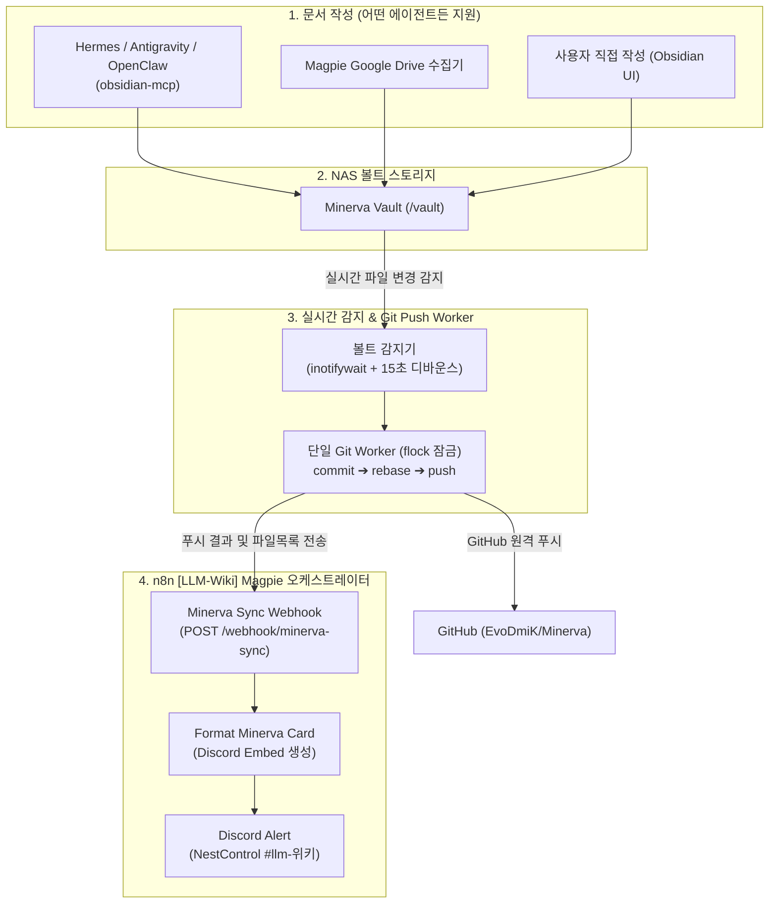

# Magpie 기반 Minerva 볼트 실시간 Git Sync 파이프라인 구축

## 요약

다른 AI 에이전트(Hermes, Antigravity, OpenClaw 등)가 Obsidian MCP(`obsidian-mcp`)를 통해 Minerva 볼트에 문서를 생성하거나 수정할 때, n8n의 `[LLM-Wiki] Magpie` 워크플로우가 자동으로 트리거되어 원격 저장소(`https://github.com/EvoDmiK/Minerva.git`)로 Git Push를 수행하고 Discord `#llm-위키` 채널로 실시간 상태 카드를 전송하는 통합 파이프라인을 구축했다.

본 작업은 로빈(Robin / Antigravity) 주도 하에 **Claude(Opus 5.5)**와 **GPT(Codex / gpt-6.1-sol)**와의 다중 에이전트 협업으로 구조를 검증 및 구현했다.

## 아키텍처 및 파이프라인

## 주요 변경 및 구성 요소

### 1. `obsidian-git-sync` 사이드카 개선 (`docker-compose/homelab/obsidian-git-sync/`)
* **`inotify-tools` & `curl` 도입:** 5분 주기 폴링 외에 Linux 커널 수준의 실시간 파일 변경(`close_write,create,delete,moved_to,moved_from`)을 즉시 감지.
* **디바운스 (Debounce):** 파일 변경 감지 후 15초간 추가 쓰기가 없을 때 커밋 & 푸시 진행 (연속 저장 대응, 최대 대기 60초).
* **무한 루프 방지:** `.git/`, `.trash/`, `.obsidian/workspace.json` 등 내부 메타데이터는 감시에서 제외.
* **Magpie 웹훅 연동:** 푸시 완료 시 `HEAD` 커밋 및 변경된 파일 목록을 n8n Magpie Webhook(`http://n8n:5678/webhook/minerva-sync`)으로 전송. 충돌 발생 시 `conflict` 상태 알림.

### 2. `[LLM-Wiki] Magpie` 워크플로우 확장 (`n8n/Magpie/workflows.json`)
* **Workflow ID:** `ujJyzlLbBQSHWcd0`
* **추가된 노드:**
  * `Minerva Sync Webhook` (`n8n-nodes-base.webhook` v2, path: `minerva-sync`)
  * `Format Minerva Card` (`n8n-nodes-base.code` v2, 상태별 시각적 Embed 생성)
  * `Minerva Discord Alert` (`n8n-nodes-base.discord` v2, `#llm-위키` 채널로 Nesty 봇 알림)

### 3. 검증 결과
* Webhook 수신 및 n8n 워크플로우 즉시 실행 확인 (Execution ID: `22130` 성공).
* `#llm-위키` 채널로 커밋 링크 및 변경 파일 목록을 담은 그린 Embed 카드(메시지 ID: `1555798360659722275`) 전송 확인.

## 관련 링크

- [[Work/Birds-Nest/index|Birds-Nest 프로젝트 인덱스]]
- [[Work/Birds-Nest/2026-10-03-Codex-사용량-리셋-모니터링-워크플로우-구축|이전 작업: Kestrel 모니터링 구축]]
- [[Home]]
