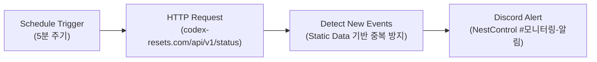

# OpenAI Codex 사용량 리셋 모니터링 워크플로우 (Kestrel) 구축

## 요약

OpenAI Codex의 사용량(한도) 리셋 정보를 제공하는 `https://codex-resets.com/api/v1/status` API를 연동하여, 리셋 완료 및 일정 예고 발생 시 Discord `모니터링-알림` 채널로 실시간 알림을 발송하는 n8n 자동화 워크플로우 `[Monitor] Kestrel`을 구축했다. Birds-Nest의 새(bird) 테마 규칙에 따라, 공중에 정지 비행(호버링)하며 지상을 날카롭게 주시하고 감시하는 황조롱이(**Kestrel**)를 워크플로우 및 디렉터리 명칭으로 적용했다.

n8n의 정적 상태 저장소(`$getWorkflowStaticData('global')`)를 활용하여 신규 리셋 이벤트 발생 시에만 알림을 발송하도록 중복 알림을 방지했으며, 첫 기동 시 현재 최신 현황 카드를 즉시 발송하여 채널 연동을 검증했다.

## 아키텍처 및 파이프라인



## 주요 구성 요소

| 노드명 | 노드 타입 | 역할 및 동작 상세 |
| --- | --- | --- |
| **Schedule Trigger** | `n8n-nodes-base.scheduleTrigger` (v1.2) | 5분 간격 주기적 트리거 (Cloudflare 엣지 캐시와 조화) |
| **Fetch Reset Status** | `n8n-nodes-base.httpRequest` (v4.2) | `GET https://codex-resets.com/api/v1/status` 호출 (무료, 무인증) |
| **Detect New Events** | `n8n-nodes-base.code` (v2) | • `latest_reset`: 신규 리셋 완료 감지 (`lastResetId` 추적)<br>• `scheduled_reset`: 리셋 예정 공지 감지 (`lastScheduledId` 추적)<br>• `active_watch`: 리셋 확률 상승 감시 (`lastWatchKey` 추적)<br>• 일시 한국 시간(KST) 변환 포맷팅 |
| **Discord Alert** | `n8n-nodes-base.discord` (v2) | `NestControl` 서버의 `모니터링-알림`(`1555400525904617542`) 채널로 Nesty 봇 메시지 전송 |

## 디스코드 메시지 포맷 (Discord Embed 카드)

디스코드 링크 자동 언펄(미리보기 박스)로 인한 화면 도배를 방지하고 시인성을 극대화하기 위해, 텍스트 본문 대신 **Discord Embed 카드 UI**로 전송 방식을 고도화했다. 모든 URL은 `<https://...>`로 래핑하여 불필요한 트위터/웹사이트 프리뷰 카드가 중복 생성되지 않도록 차단했다.

* **완료/가동 (`executed`, `init`):** 에메랄드 그린 (`#10A37F`)
* **일정 예고 (`scheduled`):** 블루 (`#3498DB`)
* **확률 감시 (`watch`):** 앰버/오렌지 (`#F39C12`)

```json
{
  "title": "⚡ [Kestrel] OpenAI Codex 사용량 리셋 완료",
  "url": "https://codex-resets.com",
  "color": 1090431,
  "description": "> Reset all propagated. Enjoy.",
  "fields": [
    { "name": "🏷️ 리셋 유형", "value": "정기 리셋 (`regular`)", "inline": true },
    { "name": "🕒 공지 일시", "value": "2026. 10. 03. 06:18 KST", "inline": true },
    { "name": "📊 통계 현황", "value": "• 평균 주기: **6.8일**\\n• 직전 리셋 후: **0.3일 경과**", "inline": false },
    { "name": "🔗 관련 링크", "value": "[공식 X(트위터) 공지](<https://x.com/...>) • [Codex Resets 대시보드](<https://codex-resets.com>)", "inline": false }
  ],
  "footer": { "text": "Codex Resets Tracker • Monitored by Kestrel 🦅" }
}
```

## 배포 및 검증 결과

* **워크플로우명:** `[Monitor] Kestrel`
* **워크플로우 ID:** `NbuvdYcU7vd5pRnp`
* **파일 경로:** `n8n/Kestrel/workflows.json`
* **배포 환경:** NAS PostgreSQL DB (`postgres-n8n`, `n8n` 데이터베이스)
* **상태:** `Active: True`
* **테스트 발송 검증:** `모니터링-알림` 채널에 초기 현황 카드 발송 성공 확인 완료.

## 관련 링크

- [[Work/Birds-Nest/index|Birds-Nest 프로젝트 인덱스]]
- [[2026-10-02-Jev-AI-기반-carrier-pigeon-개편과-n8n-테스트베드-구축|이전 작업: carrier-pigeon 개편]]
- [[Home]]


## 후속
- 2026-10-05: [[2026-10-05-Kestrel-MCP-도구화와-Hermes-연결|Kestrel MCP 도구화와 Hermes 연결]] — Hermes에서 `get_codex_reset_status`로 리셋 현황 질의 가능
