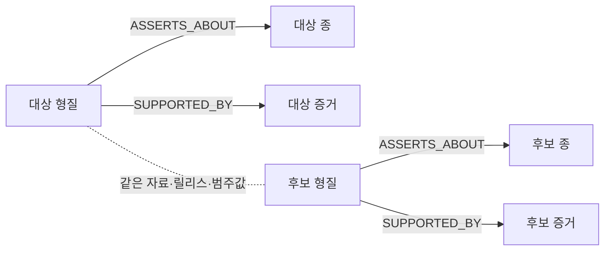

# RG-003 — 그래프 생태 관계 탐색

RG-003의 추가 관계를 **같은 자료의 서식 환경·먹이 생태 범주를 공유하는 새**로 정하고, 구현·NAS TEST 배포·실제 데이터 검증을 완료했다. RG-004~RG-009의 완료 결과를 재사용해 RG-003을 완료 처리한 것이 아니라, 별도 조회 기능과 화면을 추가했다.

## 구현과 근거

- 새 API `/v1/taxa/ecological-related`가 활성 분류판의 종을 조회하고, 출처가 있는 `habitat`·`trophic_niche` 형질을 공유하는 종을 탐색한다.
- 현재 두 범주는 기존 n8n AVONET 수집 데이터가 제공한다. PostgreSQL 활성 자료·개념집합·분류 릴리스를 확인하고, 양쪽 형질의 자료 ID·릴리스·원문 분류값을 일치시킨다. 양쪽 증거는 허용 상태와 원본 행 ID를 확인하며 추론된 형질은 제외한다.
- 분류값을 공유하는 관계를 조회 시 도출한다. 계통적 근연성이나 실제 공존·포식 관계로 주장하거나 그래프에 새 관계를 추측해 저장하지 않는다.
- 설명창의 **같은 서식 환경·먹이 생태의 새 살펴보기** 버튼에서 대상 범주·후보를 확인한다. 카드 안에는 넣지 않았다.
- 후보별 비교는 별도 답변 말풍선에 두 종 설명·카드를 제공하며, 대상 범주와 후보 출처·자료 버전·라이선스를 토글로 확인할 수 있다.
- 한국어 이름을 우선하고 없으면 영어 이름을 표시한다. 자료 없음·조회 실패·분류판 변경·대화 초기화 뒤 늦은 응답을 처리한다.
- 각 범주 최대 12종, 종별 중복 제거와 추가 결과 안내. 목록은 한국어 이름이 있는 종을 우선해 이름순으로 표시한다.

정책: [생태 관계 탐색](https://github.com/EvoDmiK/RobinGraph/blob/7f1d421e4d1b620e1bdee69d2e543fad92930453/docs/ecological-relations.md). 원자료: [AVONET 자료 페이지](https://doi.org/10.6084/m9.figshare.16586228).

## 검증

- Python 전체 515건: 실패 없음, 외부 DB 연동 32건은 설정에 따라 제외. 새 API·조회 테스트 5건 포함.
- 프런트엔드 117건 전부 통과. 출처·영어 이름·별도 말풍선·재시도·분류판/ID 변경·늦은 응답 검증.
- 커밋 후 NAS 릴리스 패키지 테스트 10건 재검증, 전부 통과.
- 실제 NAS 그래프: 청둥오리·왜가리·해오라기·대륙검은지빠귀 각 두 범주의 12개 후보, 총 96개 형질을 개별 조회해 같은 자료·릴리스·원문 범주·추론 제외를 대조했다. 최초 범주 조회 약 0.4~0.8초.
- 실제 배포 API: `v2025b`, `rg:concept-set:avilist-v2025b`, 허용된 AVONET 출처·동일 릴리스·후보 중복 없음, OpenAPI에 새 경로 포함 확인.
- Chromium 320·390·1280px: 습지·수생동물 포식 탐색, 출처 토글, 별도 비교 말풍선, 카드 두 개·뒤집기·연속 질문 확인. 가로 넘침·페이지 오류 없음.
- `Trochilus polytmus`의 꽃꿀 섭식 후보에서 `Akohekohe`, `Allen's Hummingbird`의 영어 이름 표시와 실제 비교 말풍선도 확인했다.
- GPT-6.1-sol이 UI와 자동 테스트를 구현하고 GPT-6-sol이 그래프 스키마·출처 정책과 최종 백엔드를 독립 검토했다. Codex가 백엔드·API·문서·통합 테스트·배포와 실환경 검증을 수행했다.
- graphify AST 업데이트 완료.

## 배포

- 실제 배포 커밋: `7f1d421e4d1b620e1bdee69d2e543fad92930453` (`dev`, GitHub push 완료)
- NAS TEST 이미지: `robingraph-api:test-ecology-7f1d421`
- 배포 경로: `/home/kimdove/RobinGraph-ecology-7f1d421`
- 전송 아카이브 SHA-256: `12ffefd868243d2d715305e7ddb234dd2351b43d2d673ff4201e9ea62722d6c2`, NAS와 일치·내부 파일 manifest 검증
- API health 정상. PROD 변경 없음.
- README·조회 정책 갱신. Obsidian 작업 기록과 RG-003 완료 상태도 같은 범위로 반영한다.

## 상세 보완 — 2026-10-05

### 조회 흐름과 그래프 경로

실제 ASSERTS_ABOUT 방향은 형질→종이다. 점선은 조회 시 비교 조건이며 그래프에 새로 적재한 생태 관계가 아니다. 두 형질은 각각 자신의 증거를 갖는다.

### 어떤 관계를 찾는가

이번 기능은 서식 환경과 먹이 생태를 **각각** 조회한다. 예를 들어 왜가리의 습지 후보 목록과 수생동물 포식 후보 목록은 별도 범주다. 두 조건을 동시에 만족하는 종의 교집합 검색이나 유사도 순위가 아니다.

| 대상 종 | 실제 확인한 서식 환경 | 실제 확인한 먹이 생태 |
|---|---|---|
| 청둥오리 | 습지 | 수생 초식 |
| 왜가리 | 습지 | 수생동물 포식 |
| 해오라기 | 습지 | 수생동물 포식 |
| 대륙검은지빠귀 | 숲 | 잡식 |

### 응답 필드와 제한

대상 taxon·concept_set_id·taxonomy_release와 groups를 반환한다. 각 group의 relation·value·display가 비교 기준이며 source는 대상 형질의 출처다. items의 evidence는 해당 후보의 출처로 별도 보존한다. 서로 다른 자료의 같은 문자열을 같은 의미라고 가정해 합치지 않는다.

범주별 13개를 조회하고 12개를 표시한다. has_more는 추가 후보가 있음을 안내하는 값이며 이번 구현의 페이지 이동 기능은 아니다. 한국어 이름 있는 종을 우선하고, 이름순으로 정렬한다. 한국어 이름이 없으면 영어 이름, 두 이름이 모두 없을 때 학명을 사용한다.

### 실패·빈 결과·변경 대응

- 활성 자료나 검토된 형질이 없으면 빈 범주 목록을 안내한다.
- 정확한 종이 없거나 아종 요청이면 이 생태 endpoint는 404이다.
- 조회 기능 미설정·자료 조회 실패는 503이며 내부 오류 내용을 노출하지 않는다.
- 비교 프로필의 taxon ID·분류판이 바뀌면 비교를 표시하지 않는다.
- 대화를 지운 뒤 도착한 결과는 새 대화에 추가하지 않는다.

96건의 대조는 네 종에서 각 두 범주의 12개 후보 형질, 즉 4×2×12건이다. 후보가 다른 목록에도 나올 수 있으므로 96개의 고유 종을 전수 검토했다는 뜻이 아니다. 약 0.4~0.8초는 당시 조회 관측값이며 부하 테스트나 전체 채팅 지연 보장이 아니다.

Python 515건 중 32건이 제외되어 실행 결과는 483건 성공·32건 제외·실패 없음이다. 프런트엔드 117건은 전부 성공했다. 패키지 테스트 10건은 커밋 이후 별도로 다시 확인한 결과이며 전체 515건에 더해 고유 테스트 525건이라고 계산하지 않는다.

현재 기능 간 구분과 자료·검증 층은 [[Work/RobinGraph/RobinGraph 구현·데이터·검증 가이드|구현·데이터·검증 가이드]], 상태는 [[Work/RobinGraph/RobinGraph 작업 백로그|작업 백로그]]에서 확인한다.
