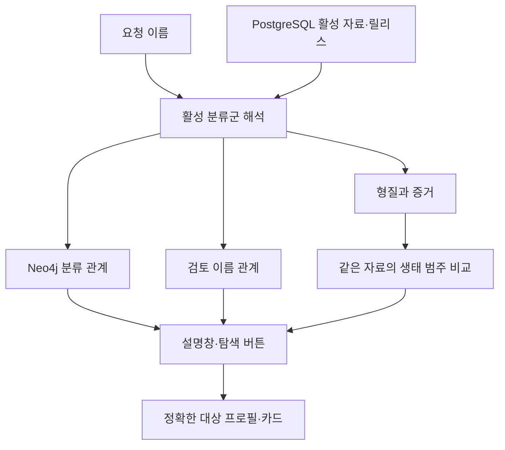

# RobinGraph 구현·데이터·검증 가이드

이 문서는 작업 기록을 기능·자료·검증 관점에서 연결한다. 상태는 2026-10-05까지의 확인 기록을 기준으로 하며, 이번 문서 보완 자체에서 서비스를 재배포하거나 외부 제공처를 새로 검증하지 않았다.

## 요청 범위 정정과 후속 구현

RG-003을 생태 탐색 버튼 추가로 좁혀 완료 처리했던 해석을 정정했다. 실제 요구는 자연어 질문에 맞는 형질·관계를 바로 조회하고 응답하는 기능이다. [[Work/RobinGraph/2026-10-05-RG003-자연어질문-그래프답변-NAS배포|자연어 질문별 그래프 답변·실환경 검증]]에서 요청한 두 질문 및 지원 표현을 NAS API·브라우저로 검증했다. 버튼은 보조 경로이며 관련 후보를 보기 위해 추가 클릭할 필요가 없다.

## 현재 작업 상태

| 항목 | 완료 범위 | 기록 |
|---|---|---|
| RG-001 | MLflow 연동·NAS TEST·실제 trace API 검증 | [[Work/RobinGraph/RobinGraph 작업 백로그|백로그]] |
| RG-002 | PROD 실제 종 데이터 준비 대기 | [[Work/RobinGraph/RobinGraph 작업 백로그|백로그]] |
| RG-003 | 자연어 먹이·서식·활동·외관 질문 및 분류·생태 관련 종 직접 답변 | [[Work/RobinGraph/2026-10-05-RG003-자연어질문-그래프답변-NAS배포|자연어 직접 답변 기록]] |
| RG-004 | 검토 이름 관계 확대·적재·통칭 및 아종 카드 연결 | [[Work/RobinGraph/2026-10-03-그래프-통칭-가축형관계-확대조사-NAS-TEST배포|관계 조사]] · [[Work/RobinGraph/2026-10-03-그래프검색-아종-통칭카드-NAS배포|카드 연결]] |
| RG-005~RG-009 | 비교 말풍선·활동 시간·번역·먹이 아이콘·사진 실패 처리 | [[Work/RobinGraph/2026-10-03-RG005-RG009-비교-생태정보-사진처리-NAS배포|독립 기능 기록]] |

RG-004~RG-009는 RG-003의 하위 작업이 아니다. 각 항목의 별도 범위·완료 기준으로 상태를 판단한다. MLflow 화면의 직접 시각 확인 여부는 trace API 검증과 구분한다.

## 자료별 역할과 수집 방식

| 자료 | 제공 정보 | 처리 방식·한계 |
|---|---|---|
| AviList v2025b | 분류군·부모 관계·영어 이름·스냅샷 보전 상태 | 기존 n8n 수집, 활성 개념집합·분류 릴리스 검증 |
| 허용된 한국어 이름 자료 | 분류군의 한국어 이름·출처 | 활성 이름 자료의 정책·대상 확인 |
| EltonTraits | 먹이 구성·야행성 코드 등 | 기존 n8n 수집, 자료의 분류값과 생물학적 설명을 구분 |
| AVONET | 형태 측정·서식 환경·먹이 생태 등 | 기존 n8n 수집, 자료·릴리스·분류 매핑 유지 |
| 검토 이름 manifest | 통칭·별칭·가축형·품종 관련 종 | 검토 후 별도 적재 스크립트, n8n 자동 조사 아님 |
| 검토 설명 코드 | 해오라기 활동 시간·일부 아종 분포 | 출처·정확한 대상·분류판 조건으로 제한 |
| 사진 제공 API | 정확한 분류군의 사진 후보·파일 정보 | 요청 시 조회, 개별 파일의 출처·저작자·사용 조건 확인 |
| PMC 문헌 파일럿 | 검색 가능한 논문 청크·인용 | 허용 논문 1편의 TEST 실험, 전체 문헌 수집 서비스 아님 |
| GBIF 관찰 영역 | 관찰 자료와 외부 분류 개념 | AviList 분류 트리와 분리 |

자료가 그래프에 있다는 것과 모든 종의 완전한 설명·사진·한국어 이름을 갖췄다는 것은 다르다. 19,879개 아종 노드도 모든 아종의 고유 형질이나 사진을 확보했다는 수치가 아니다.

## Neo4j와 PostgreSQL의 역할

Neo4j는 분류·이름·형질·증거 등 도메인 관계를 조회한다. PostgreSQL은 승인 자료·불변 릴리스·원본 기록·활성 수집 상태를 관리한다. 조회는 PostgreSQL의 활성 문맥을 확인한 뒤 그 문맥에 속한 그래프를 읽는다. 연결되어 있다는 이유만으로 과거 릴리스나 불허 자료를 현재 답변에 섞지 않는다.

생태 범주 관계는 서로 다른 두 형질 노드의 같은 원문 값을 비교해 조회 시 도출한다. 실제 먹이사슬 관계를 새로 저장한 것이 아니다.

## 기능별 API와 사용자 흐름

| API | 목적 | 중요한 조건 |
|---|---|---|
| POST /v1/chat | 질문 처리와 설명·근거·후보 안내 | 이름 관계·분류·관찰·근거 경로 구분 |
| GET /v1/taxa/profile | 종 또는 아종의 자료·카드 | 직접 형질과 부모 참고 형질 분리 |
| GET /v1/taxa/related | 같은 속·과의 후보 | 분류 관계이며 진화적 거리 순위 아님 |
| GET /v1/taxa/ecological-related | 같은 서식 환경 또는 먹이 생태 | 같은 자료·릴리스·원문 값, 범주별 최대 12종 |
| GET /v1/taxa/subspecies | 종에 연결된 실제 아종 | 활성 PARENT_OF, 최대 200개와 한도 안내 |
| GET /v1/taxa/name-relations | 검토 이름↔관련 종 | manifest·그래프·활성 분류판 일치 |
| GET /health | 프로세스·모드·배포 대상 확인 | 실제 기능·실데이터 확인을 대신하지 않음 |

자연어 질문의 종과 주제를 추출해 해당 답변·출처를 먼저 표시하고 관련 후보를 바로 준비한다. 설명창 버튼에서도 탐색할 수 있으며, 선택한 정확한 대상의 프로필과 카드 버튼을 준비한다. 비교는 원래 답변을 보존한 채 새 말풍선으로 표시한다. 범주의 교집합·서식 지역 공존·포식 관계·수치 유사도 검색은 RG-003의 이번 완료 범위에 포함하지 않는다.

한국어 이름이 없을 때 영어 이름을 표시하는 규칙과 모든 영어 일반명을 검색 키로 지원하는 기능은 구분한다. 후보 버튼은 정확한 학명으로 프로필을 조회한다.

## 데이터 해석과 표시 정책

- 원문 값과 display 번역을 분리한다. 번역이 없으면 미확인으로 안내한다.
- 결측은 없다는 생물학적 사실로 바꾸지 않는다. 야행성 코드 0도 야간 활동 부재로 단정하지 않는다.
- 아종에는 부모 종의 체중·먹이·사진·보전 상태를 상속하지 않는다. 참고 정보는 별도 출처와 종 이름을 붙인다.
- 가축형·품종 관계는 관련 야생종의 자료라는 설명을 유지한다.
- 먹이 아이콘은 같은 자료의 확인된 양의 값에서 만든다. 다른 자료의 비율을 합산하지 않는다.
- 사진 실패 시 설명·카드·뒤집기를 유지한다. 다른 종의 사진으로 대체하지 않는다.
- 카드 색은 스냅샷의 보전 상태에 따른 연출이다. 실시간 IUCN 평가나 실제 관찰 희귀도 측정값은 아니다.

## 테스트 결과를 읽는 방법

| 검증 층 | 알 수 있는 것 | 별도로 확인할 것 |
|---|---|---|
| 단위·계약 테스트 | 조건·실패·응답 처리의 회귀 | 실제 활성 DB 자료 |
| 외부 DB 통합 | 적재·릴리스·정책·조회 연결 | 배포 이미지·프록시 경로 |
| 배포 API | 실행 서비스의 실제 데이터·계약 | 실제 브라우저 동작 |
| 브라우저 | 말풍선·카드·출처 토글·모바일·연속 질문 | 전체 데이터 품질·대규모 부하 |
| health | 프로세스 정상 상태 | 종의 실제 결과·출처 정확성 |

앞선 생태 버튼 기록은 Python 515건 중 483건 성공·32건 제외, 프런트엔드 117건 성공이었다. 후속 자연어 질문 구현은 Python 524건 중 492건 성공·32건 제외, 프런트엔드 121건 성공이다. 별도의 패키지 테스트 10건은 재확인 결과다. 테스트 수는 날짜별 버전의 기록이며 서로 합산해 고유 테스트 수로 쓰지 않는다. 96건은 4종×2범주×12개 후보 형질의 대조 건수이며 고유 후보 종 수가 아니다.

## 배포 기록을 읽는 방법

마지막 작업에서 확인한 TEST 이미지: `robingraph-api:test-natural-4a30e12`. 배포 커밋: `4a30e126cc463f0e49a129e19ad0176dce56ce69`. 문서 기록을 추가한 후속 커밋과 실행 이미지의 소스 커밋은 구분한다.

릴리스 경로는 `/home/kimdove/RobinGraph-natural-4a30e12`이다. 이력 분기된 기존 checkout을 초기화하는 대신 별도 릴리스 디렉터리를 사용했다. 전송 해시·내부 manifest·이미지 태그·health·실제 API·브라우저 결과를 함께 확인했다.

health의 fixture-avlist-2025는 일부 fixture 응답 영역의 표기이며, 실제 분류·생태 조회 검증은 v2025b 및 rg:concept-set:avilist-v2025b를 기준으로 한다. 두 값을 같아야 한다고 검증하지 않는다.

이번 기능은 TEST에 배포했다. 과거 카드 코드의 PROD 배포 기록이 있다고 최신 기능과 실제 종 데이터의 PROD 검증까지 완료된 것은 아니다. RG-002의 PROD 준비는 별도다.

## 다음 작업을 기록할 때

목적·정확한 관계·자료 출처·활성 분류판·실패 시 처리·완료 기준을 백로그에 먼저 적는다. 검증 기록에는 실행한 층과 제외한 항목을 구분하고, 구현 커밋과 배포 커밋을 함께 기록한다. 문서 상세화만 한 경우에는 새 기능 구현·배포·테스트를 수행했다고 기록하지 않는다.

## 작업 기록 목록

- [[Work/RobinGraph/2026-09-29-CI-수정-Gemini-연동-PMC-문헌파일럿|2026-09-29-CI-수정-Gemini-연동-PMC-문헌파일럿]]
- [[Work/RobinGraph/2026-09-30-NAS-Git이력분기-구형이미지-Gemini검색복구-525진단|2026-09-30-NAS-Git이력분기-구형이미지-Gemini검색복구-525진단]]
- [[Work/RobinGraph/2026-09-30-한국어검색-Gemini-PostgreSQL-연결수정-NAS배포준비|2026-09-30-한국어검색-Gemini-PostgreSQL-연결수정-NAS배포준비]]
- [[Work/RobinGraph/2026-10-01-조류도감카드-대화버그수정-멸종위기등급-NAS배포|2026-10-01-조류도감카드-대화버그수정-멸종위기등급-NAS배포]]
- [[Work/RobinGraph/2026-10-02-임베딩-API-내부망-직접-호출|2026-10-02-임베딩-API-내부망-직접-호출]]
- [[Work/RobinGraph/2026-10-03-RG005-RG009-비교-생태정보-사진처리-NAS배포|2026-10-03-RG005-RG009-비교-생태정보-사진처리-NAS배포]]
- [[Work/RobinGraph/2026-10-03-그래프-통칭-가축형관계-확대조사-NAS-TEST배포|2026-10-03-그래프-통칭-가축형관계-확대조사-NAS-TEST배포]]
- [[Work/RobinGraph/2026-10-03-그래프검색-아종-통칭카드-NAS배포|2026-10-03-그래프검색-아종-통칭카드-NAS배포]]
- [[Work/RobinGraph/2026-10-05-RG003-생태관계탐색-NAS배포|2026-10-05-RG003-생태관계탐색-NAS배포]]

- [[Work/RobinGraph/2026-10-05-RG003-자연어질문-그래프답변-NAS배포|자연어 질문별 그래프 답변·실환경 검증]]
